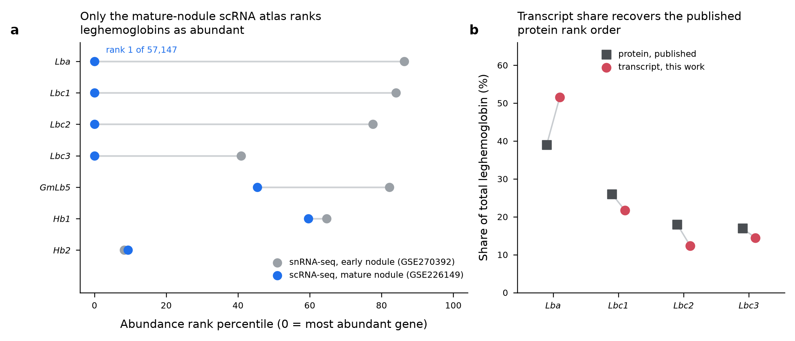
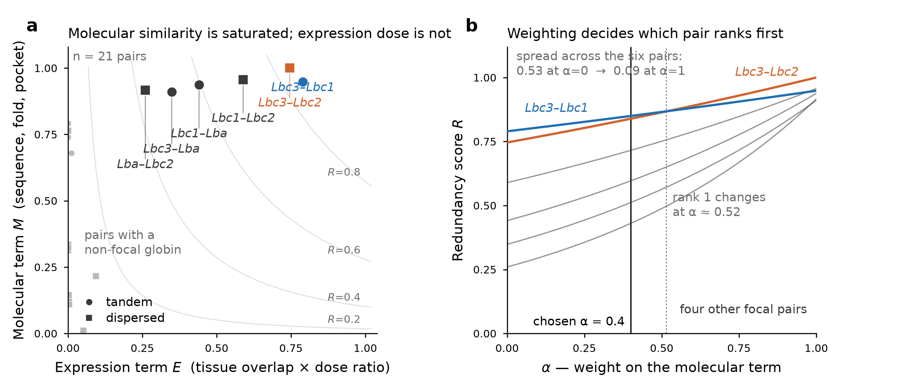

# Soybean leghemoglobin redundancy — Boston Computational Biology Hackathon

Predicting ortholog/paralog **functional redundancy** in soybean (*Glycine max*),
using the leghemoglobin family as the test case. The design is four modules —
sequence, structure, expression, integration — feeding one weighted redundancy
score.

## Status

| module | state | outputs |
|---|---|---|
| 1 — sequence | **done** | `results/sequence_module/` |
| 2 — structure | **done** | `results/structure_module/` |
| 3 — expression | **done, at pseudobulk resolution only** | `results/expression_module/` |
| 4 — integration / redundancy score | **done, at tissue resolution only** | `results/integration_module/` |

All four modules run end to end. The three pair tables join on a canonical key
and module 4 reduces them to one score per pair (§4). §5 lists what is still
missing — one item, and it is the one that matters: no cell-type resolution
anywhere, so the expression term rests on two tissue means.

**The headline result.** Within the leghemoglobin clade every molecular measure
is saturated — sequence identity 91.7–95.2%, ESM2 cosine distance
0.0006–0.0024, TM-score 0.9816–0.9976 — and the score's discriminating power
comes almost entirely from expression dose. Redundancy is also **directional**:
Lba covers each of Lbc1/Lbc2/Lbc3 at ≥ 0.96, while they cover Lba at
0.43–0.60: Lba supplies 49% of the nodule leghemoglobin pool (nodule-mean CPM;
51.5% by total counts across the five libraries) and its largest single partner
supplies only 44% of Lba's own dose.
The three minor isoforms look individually dispensable; Lba does not.

`NEXT_RUN.md` is the current handoff and was rewritten against this state. Its
own earlier sections on structure and expression are superseded by §2/§3 below.

Focal genes (Wm82.a4.v1 IDs):

| symbol | gene ID | chromosome |
|---|---|---|
| Lba | `Glyma.10G199100` | Gm10 |
| Lbc1 | `Glyma.10G199000` | Gm10 |
| Lbc2 | `Glyma.20G191200` | Gm20 |
| Lbc3 | `Glyma.10G198800` | Gm10 |

---

## 1. Module 1 — sequence

Runner: `pipeline/run_local.py`. Wall time 11.3 s with references cached.

### 1.1 Reference data

Phytozome requires a JGI login, so the Wm82.a4.v1 files were taken from
**SoyBase**, which serves the identical annotation under its own release name
`Wm82.gnm4.ann1.T8TQ`:

- `glyma.Wm82.gnm4.ann1.T8TQ.protein_primary.faa.gz` — 52,872 primary-transcript proteins
- `glyma.Wm82.gnm4.ann1.T8TQ.gene_models_exons.gff3.gz` — gene models

The **PF00042 (Globin)** HMM came from the InterPro API
(`/entry/pfam/PF00042?annotation=hmm`), resolving to **PF00042.29**, model
length 117, gathering threshold **GA = 22**.

sha256 of all three inputs is recorded in
`results/sequence_module/manifest.json`. The downloads are *not* committed —
`pipeline/run_local.py` re-fetches them into `data/`.

> Identifier convention: proteins are `glyma.Wm82.gnm4.ann1.Glyma.10G199100.1`,
> GFF3 seqids are `glyma.Wm82.gnm4.Gm10`. `soy_globin_core.gene_of()` strips
> both down to the bare `Glyma.10G199100` used everywhere else.

### 1.2 Family selection — 7 proteins

`hmmsearch --cut_ga` against the full primary proteome, unioned with the four
focal gene IDs (belt and braces — none of them actually needed rescuing).

| gene | symbol | length | bit score | E-value | PF00042 coverage |
|---|---|---|---|---|---|
| `Glyma.11G121800` | — | 161 | 79.6 | 7.1e-22 | 0.99 |
| `Glyma.11G121700` | — | 157 | 76.7 | 5.7e-21 | 0.99 |
| `Glyma.20G191200` | **Lbc2** | 145 | 69.2 | 1.2e-18 | 0.98 |
| `Glyma.10G198900` | — | 151 | 67.4 | 4.3e-18 | 0.98 |
| `Glyma.10G199000` | **Lbc1** | 144 | 66.7 | 7.1e-18 | 0.98 |
| `Glyma.10G199100` | **Lba** | 144 | 66.0 | 1.2e-17 | 0.98 |
| `Glyma.10G198800` | **Lbc3** | 145 | 63.2 | 8.9e-17 | 0.98 |

Seven felt low for a paleopolyploid, so a relaxed search (`-E 10`) was run to
check the cutoff wasn't truncating the family. It isn't: the 8th-best protein
in the genome scores **13.5** (E = 0.23), a ~50-bit gap below the weakest real
hit. The three non-focal members are a fifth chr10 cluster gene
(`Glyma.10G198900`) and a chr11 tandem pair (`Glyma.11G121700/121800`) that
are non-symbiotic phytoglobins — these are what root the Lb clade.

Module 2 later resolved all three against UniProt: `Glyma.10G198900` is
**GmLb5 / leghemoglobin 5** (`LGB5_SOYBN`, A0A0R0HW51), and the chr11 pair are
the anaerobic nitrite reductases **Hb1** (`NSHB1_SOYBN`) and **Hb2**
(`NSHB2_SOYBN`). That answers half of open question 1 in `NEXT_RUN.md` §6 —
`Glyma.10G198900` is a named leghemoglobin, not an unannotated locus — but not
whether it belongs in the ingroup, which is still the human's call.

**This set does not include class-3 truncated hemoglobins**, which match
**PF01152** (Bacterial-like globin), not PF00042. If you want a deeper
outgroup, that is the one-line change.

### 1.3 Alignment and phylogeny

MAFFT **L-INS-i** (`--localpair --maxiterate 1000`) → 162 columns. IQ-TREE
with ModelFinder, 1000 ultrafast bootstrap replicates, 1000 SH-aLRT
replicates, fixed seed 20240601. Best-fit model **Q.PLANT+I**.

```
(Glyma.20G191200_Lbc2:0.0153934781,((Glyma.10G199000_Lbc1:0.0257420508,
((Glyma.11G121800:0.1010816599,Glyma.11G121700:0.1164176392)100/100:1.6993936020,
Glyma.10G198900:0.0888325425)79.7/70:0.1463466693)45.4/47:0.0154733173,
Glyma.10G199100_Lba:0.0478835571)31.1/39:0.0126731124,Glyma.10G198800_Lbc3:0.0419615774);
```

Node labels are `SH-aLRT/UFBoot`. The phytoglobin split is 100/100 on a very
long branch (1.70), as expected for an outgroup. **Within the Lb clade the
support is poor** — 45.4/47 and 31.1/39 — which is not a bug: four sequences
at >91% identity over 162 columns do not contain enough signal to resolve
their branching order. Do not build an argument on the internal Lb topology.

### 1.4 Pairwise identity

Computed from the MSA (not from independent pairwise alignments), so it is
consistent with the tree. Percent identity over columns where **both**
sequences have a residue:

|  | Lbc2 | Lbc1 | Lba | Lbc3 | 11G121800 | 11G121700 | 10G198900 |
|---|---|---|---|---|---|---|---|
| **Lbc2** (Gm20) | — | 93.8 | 93.1 | **95.2** | 43.4 | 45.5 | 80.0 |
| **Lbc1** (Gm10) | 93.8 | — | 92.4 | 91.7 | 43.8 | 45.8 | 79.9 |
| **Lba** (Gm10) | 93.1 | 92.4 | — | 92.4 | 43.1 | 45.1 | 77.8 |
| **Lbc3** (Gm10) | **95.2** | 91.7 | 92.4 | — | 42.8 | 44.1 | 77.2 |

A second convention (`pid_shorter`, identities ÷ shorter ungapped length) is
in `pairwise_identity_pairs.csv`; it matters only for partial sequences, which
this family doesn't have.

### 1.5 ESM2-650M embeddings

`facebook/esm2_t33_650M_UR50D`, final hidden layer, **mean-pooled over residue
tokens only** — BOS, EOS and PAD are masked out before averaging, which
matters because sequences of different length are batched together. Cosine
distance = 1 − cosine similarity of the 1280-d pooled vectors.

| pair class | cosine distance |
|---|---|
| within the four Lbs | 0.0006 – 0.0024 |
| any Lb vs `Glyma.10G198900` | 0.0050 – 0.0058 |
| any Lb vs `Glyma.11G121700` | 0.0731 – 0.0758 |
| any Lb vs `Glyma.11G121800` | 0.1426 – 0.1447 |

**This stage ran on CPU, not on a GPU** (see §9.1). The Modal path uses fp16 on
an A10G and will differ in the fourth decimal; the committed matrix is fp32.

### 1.6 Duplication mode

From GFF3 gene order alone — every gene on a sequence is ranked by start
coordinate, and a pair is called by how many protein-coding genes sit between
its members:

- `tandem` — same sequence, ≤ 10 intervening genes
- `proximal` — same sequence, more intervening genes but ≤ 1 Mb apart
- `dispersed` — different sequence, or beyond the proximal window

Result: **7 tandem, 14 dispersed, 0 proximal** across 21 pairs. The chr10
cluster is four contiguous genes, all on the minus strand:

| gene | symbol | start | end | rank on Gm10 |
|---|---|---|---|---|
| `Glyma.10G198800` | Lbc3 | 43,082,011 | 43,083,137 | 1836 |
| `Glyma.10G198900` | GmLb5 | 43,085,930 | 43,089,182 | 1837 |
| `Glyma.10G199000` | Lbc1 | 43,090,608 | 43,091,995 | 1838 |
| `Glyma.10G199100` | Lba | 43,095,323 | 43,097,067 | 1839 |

`Glyma.20G191200` (Lbc2) is the single Gm20 copy at 42,955,083–42,956,301.

---

## 2. Module 2 — structure

Runner: `pipeline/run_structure.py`. Wall time 12.8 s. **No GPU was used and
no structure was predicted** — `NEXT_RUN.md` budgeted ESMFold on Modal for
this stage and it turned out to be unnecessary.

### 2.1 Structures come from AlphaFold DB

Every member of the family has a **reviewed** UniProt entry, so every member
has an AFDB model. Genes were resolved to accessions through the UniProt
search API (taxon 3847), then models pulled through
`alphafold.ebi.ac.uk/api/prediction/<acc>`.

| label | UniProt | entry | protein name | mean pLDDT |
|---|---|---|---|---|
| Lba | `P02238` | LGB3_SOYBN | Leghemoglobin 3 / GmLba | 96.5 |
| Lbc1 | `P02235` | LGB2_SOYBN | Leghemoglobin 2 / GmLbc1 | 95.8 |
| Lbc2 | `P02236` | LGB4_SOYBN | Leghemoglobin 4 / GmLbc2 | 95.7 |
| Lbc3 | `P02237` | LGB1_SOYBN | Leghemoglobin 1 / GmLbc3 | 96.1 |
| `Glyma.10G198900` | `A0A0R0HW51` | LGB5_SOYBN | Leghemoglobin 5 / GmLb5 | 81.6 |
| `Glyma.11G121700` | `I1LJI1` | NSHB1_SOYBN | Anaerobic nitrite reductase Hb1 | 94.4 |
| `Glyma.11G121800` | `Q42785` | NSHB2_SOYBN | Anaerobic nitrite reductase Hb2 | 93.8 |

All seven are AFDB model_v6 (created 2025-08-01). Note the older AFDB *file*
URL pattern (`AF-<acc>-F1-model_v4.pdb`) no longer resolves — go through the
API and use the URL it hands back.

**AFDB models are keyed on the UniProt sequence, which is not always the
Wm82.a4 primary transcript.** Each model is therefore aligned back to the a4
protein and the identity and length delta recorded in `structures.csv`. Six of
seven are byte-identical to the a4 sequence. The exception is
**`Glyma.10G198900` / GmLb5**: the UniProt sequence is 168 aa against 151 aa
for the a4 primary transcript — 100% identical over the 151 aligned columns,
i.e. a 17-residue extension rather than a different gene. Its pLDDT is also
the lowest in the set (81.6, with 7.7% of residues very low). Treat GmLb5
structural numbers as the least reliable row in the table.

### 2.2 The heme pocket is transferred from a crystal structure

AFDB models are apo, so there is no ligand to measure contacts against.
Residues with any heavy atom within **5.0 Å** of any heme heavy atom in
**1BIN** (soybean leghemoglobin-a, 2.20 Å) define the pocket: **23 residues**.
Those positions are transferred onto every family member through the MAFFT
alignment module 1 already produced — all 23 mapped, none dropped.

As an independent check, UniProt's own heme-binding annotations for P02238
were fetched separately: **4 of 5 annotated sites fall inside the
crystal-derived pocket**. The annotations are a check on the transfer, not its
source.

### 2.3 Global fold is saturated; the pocket is not

`NEXT_RUN.md` §2 predicted, in advance, that global TM-score would be
uninformative within the Lb clade (>0.95 for all six pairs). **That prediction
held.** TM-score is normalised by the shorter chain — the conservative choice,
since it cannot be inflated by one protein being a fragment of the other.

| pair | TM-score | RMSD (Å) | pocket identity (23 residues) |
|---|---|---|---|
| Lbc2 – Lbc3 | **0.9976** | 0.221 | **100.0** |
| Lbc2 – Lbc1 | 0.9915 | 0.428 | 95.7 |
| Lbc1 – Lbc3 | 0.9904 | 0.460 | 95.7 |
| Lbc2 – Lba | 0.9863 | 0.919 | 91.3 |
| Lba – Lbc3 | 0.9844 | 0.915 | 91.3 |
| Lbc1 – Lba | 0.9816 | 0.992 | 95.7 |
| any Lb – GmLb5 | 0.939 – 0.952 | 1.05 – 1.61 | 82.6 – 87.0 |
| any Lb – chr11 Hb1/Hb2 | 0.820 – 0.918 | 1.42 – 2.41 | 52.2 – 56.5 |

Two things to carry forward:

1. **Global TM-score adds nothing within the clade** (0.9816–0.9976, a range of
   0.016). Fold it into the molecular-interchangeability term if you like, but
   do not expect it to move the ranking.
2. **Pocket identity does vary** — 91.3% to 100% — and it varies *in the same
   direction as sequence identity*: Lbc2–Lbc3 is the top pair on all three
   measures (95.2% sequence identity, 0.9976 TM, identical pocket), and both
   pairs involving Lba are the bottom (91.3%). Across 23 positions that is 2
   substitutions versus 0, so it is a weak discriminator — but it is the only
   structural quantity here that discriminates at all, and
   `pocket_residues.csv` shows exactly which positions differ.

---

## 3. Module 3 — expression (pseudobulk)

Runner: `pipeline/soy_globin_expression.py` (module and CLI in one file).

### 3.1 The atlas named in the plan was rejected, with a diagnostic

`NEXT_RUN.md` §3 specified **GSE270392** (Zhang et al. 2024 *Cell*) — snRNA-seq
of *early* nodule with annotated infected cells. It is not usable for this
question, and the reason is measurable rather than a matter of taste: nuclear
RNA is depleted of abundant stable cytoplasmic transcripts, and leghemoglobin
is the extreme case of such a transcript.

In GSE270392's 29,436 nuclei:

| gene | total counts | rank (of 52,594) |
|---|---|---|
| Lba | 668 | 45,386 |
| Lbc1 | 777 | 44,218 |
| Lbc2 | 1,096 | 40,807 |
| Lbc3 | 3,038 | 21,481 |
| GmLb5 | 865 | 43,245 |
| Hb1 | 1,733 | 34,031 |
| **Hb2** (intended negative control) | **7,663** | **4,343** |

Median gene total in that matrix is 2,496, so three of the four Lbs sit below
the median gene, and the most abundant globin in the sample is the chr11
non-symbiotic haemoglobin that was supposed to be the outgroup. Co-expression
there would rest on 9–33 co-detected nuclei per Lb pair.

**GSE226149 is used instead** — mature nodule + root, protoplast scRNA-seq —
as **pseudobulk**: counts summed over every barcode in a library. Five
libraries, 14.7–48.6 M counts each: 2 nodule (`GSM7065810/11`), 3 root
(`GSM7065807/08/09`). In it, Lba is **rank 1 of 57,147 genes** and alone
carries 1.86% of all counts in the sample.



Panel **b** is the reason to trust the switch: transcript share of total
leghemoglobin computed here (Lba 51.5%, Lbc1 21.7%, Lbc3 14.4%, Lbc2 12.4%)
recovers the published **protein** rank order of the four isoforms. The
published protein values plotted alongside come from the literature and are
**not sourced in-repo** — see §9.7.

### 3.2 What pseudobulk can and cannot give

Cell calling, clustering and cell-type annotation deliberately do **not**
happen in this module: the published cell-type labels are not in the GEO
submission, and re-deriving them would substitute a different piece of work
for the one the design asks for. The consequence is stated rather than worked
around — `detection_rate` and `coexpression_overlap` are per-*cell* quantities
and pseudobulk has no cells, so both are emitted as **NA with a reason
string**, not replaced by a look-alike statistic.

Per-gene profiles (CPM over summed library counts):

| gene | symbol | nodule mean CPM | root mean CPM | τ |
|---|---|---|---|---|
| `Glyma.10G199100` | Lba | 19,452 | 0.06 | >0.9999 |
| `Glyma.10G199000` | Lbc1 | 8,577 | 0.02 | >0.9999 |
| `Glyma.10G198800` | Lbc3 | 6,774 | 0.01 | >0.9999 |
| `Glyma.20G191200` | Lbc2 | 5,055 | 0.01 | >0.9999 |
| `Glyma.10G198900` | GmLb5 | 1.95 | 0.00 | 1.000 |
| `Glyma.11G121800` | Hb2 | 28.1 | 10.4 | 0.630 |
| `Glyma.11G121700` | Hb1 | 0.45 | 0.66 | 0.319 |

The four Lbs are nodule-exclusive to five orders of magnitude; the chr11
phytoglobins are not tissue-specific at all. **τ is computed over two tissue
means, so it collapses to a nodule-vs-root contrast** — do not read it as a
tissue-specificity index in the usual sense.

`marker_profiles.csv` carries four nodule markers as controls. NOD26
(`Glyma.08G120100`, symbiosome membrane, infected cells) behaves as expected
at 5,365 CPM nodule vs 0.39 root. Note `Glyma.10G121524` (uricase-2 /
nodulin-35, the uninfected-interstitial-cell marker) is **absent from the
GSE226149 feature list** and comes back `in_matrix=False`.

### 3.3 Pairwise co-expression

Spearman correlation of log1p-CPM profiles across the five libraries:

- **all six pairs among the four focal Lbs: ρ = 1.000** over 5 points. This is
  degenerate, not informative: those four share one zero/nonzero pattern across
  the three root libraries, so they rank identically and ρ is forced to 1. It is
  not a property of nodule-exclusive genes in general — GmLb5 is zero in all
  three root libraries where the focal four have one small nonzero value, and
  its Lb pairs come out at 0.803 on that different tie pattern. Either way, five
  points over two tissues cannot separate co-regulated genes; do not feed this
  into a score as if it carried information.
- Lb vs GmLb5: 0.803 · Lb vs Hb2: 0.718 · Lb vs Hb1: 0.051 · GmLb5 vs Hb1: −0.335

The correlation term is therefore **saturated in the same way sequence
identity is**, and for a structural reason: five points, two tissues. Getting
a real expression discriminator requires cell-type or cell-state resolution
(§5.1), not a different correlation coefficient.

---

## 4. Module 4 — integration and the redundancy score

Runner: `pipeline/run_integration.py`, logic in `pipeline/soy_globin_integration.py`,
figure in `pipeline/plot_integration.py`. Wall time 0.4 s — it consumes only what
modules 1–3 emitted, and touches no network, no GPU and no reference data.

### 4.1 The score

```
R = M**0.40 * E**0.60
```

**Gated, not additive.** Two genes that are 95% identical but never expressed
in the same place are not functionally redundant, because neither can buffer
the other's loss. An additive score would award such a pair a high value on
sequence alone; a product cannot. This is the one piece of the design in
`NEXT_RUN.md` §4 that survived contact with the data unchanged.

**`M` — molecular interchangeability**, the equally weighted mean of three
sub-axes rather than of four flat features:

| sub-axis | from |
|---|---|
| sequence | mean of normalised `pid_aligned` and normalised ESM2 similarity |
| global fold | normalised TM-score |
| heme pocket | normalised pocket identity over the 23 mapped residues |

The four raw features are collinear across all 21 pairs (Spearman 0.85–0.94),
so averaging them as equals is a re-weighting of one axis with sequence counted
twice. Within the six Lb pairs they come apart — identity against pocket
identity is only ρ = 0.39 — which is precisely where the question lives. Three
axes gives the pocket a full third instead of a quarter.

**`E` — expression co-availability**, `tissue_overlap × dose_ratio`, both
already bounded in [0, 1]:

- `tissue_overlap` is the histogram intersection of the two genes' normalised
  tissue-mean CPM profiles: 1.0 means they place transcript in the same tissues
  in the same proportions. It replaces the binary co-expression gate of the
  original design, which with two tissues would be either always open or always
  shut.
- `dose_ratio` is the smaller nodule-mean CPM over the larger. Dose is
  load-bearing, not decorative: on nodule-mean CPM the four Lbs split the pool
  49 / 21 / 17 / 13 (Lba / Lbc1 / Lbc3 / Lbc2), and the 13% gene cannot cover
  the loss of the 49% one.

**Two normalisation scopes are emitted, because the choice moves the answer
more than the weights do.** The molecular axes are min-max scaled over all 21
pairs, so `M` is on one absolute scale. `R_family` uses `M` and `E` as they
stand and is comparable across the whole family, with outgroup pairs correctly
near zero. `R_clade` rescales `M` and `E` — each as a whole, onto [0.05, 1] —
across the six Lb pairs only, and is a *relative* ranking in which the lowest
value means "lowest of the six observed", not "not redundant". The floor exists
because a plain min-max zero in either factor would zero the product and merge
pairs that differ; it changes no ordering. The gap between the two scopes is
the saturation result, not something to hide by picking one.

### 4.2 What each component actually contributes

This is the part that decides how much the score is worth, and it has not
changed since it was written down as a constraint — it has only been quantified.

**The molecular term is saturated within the clade.** Across the six Lb pairs
the three sub-axes span:

| sub-axis | range over the 6 Lb pairs | spread |
|---|---|---|
| sequence | 0.965 – 1.000 | 0.035 |
| global fold | 0.937 – 1.000 | 0.063 |
| **heme pocket** | **0.818 – 1.000** | **0.182** |

Sequence and fold contribute almost nothing. The pocket carries three times the
spread of the other two combined, and that spread is two substitutions out of
23 positions. `M` itself ranges 0.911–1.000.

**The expression term is where the variance is** — but only after replacing the
metric. The specified co-expression statistic, Spearman over the five
libraries, is exactly 1.000 for all six Lb pairs (§3.3) and carries no
information. `dose_ratio` over the same pairs spans 0.260–0.790, and `E` spans exactly the
same range, because tissue overlap is 1.000 for all six Lb pairs. Across the 15
outgroup pairs `E` spans 0.00001–0.093 — the 12 pairs with one focal member
reach only 0.0041, the three outgroup-only pairs go up to 0.093 — so the lowest
Lb–Lb value is 2.8× the highest outgroup value and the term separates controls
on its own.

**Consequence for the weights.** `NEXT_RUN.md` §4 recommended `alpha=0.35,
beta=0.65` on the reasoning that `M` was saturated and `E` would discriminate.
The lean toward expression turns out to be right, but for a different reason:
`E` discriminates only in the dosage formulation, not the correlational one it
was specified as. α = 0.40 keeps that lean; §4.4 reports what it buys.

### 4.3 Results



*(a) All 21 pairs in the M–E plane, with iso-R contours of the gated score. The
six focal pairs sit in a narrow band at the top — M spans 0.911–1.000 — and are
spread out along E. Pairs involving a non-focal globin collapse onto E ≈ 0.
(b) Every focal pair's score as α sweeps 0 → 1. The two coloured pairs swap
first place at α ≈ 0.52, and the spread across all six collapses from 0.53 to
0.089 as the molecular term takes over.*

The six focal pairs, ranked by the absolute score. "a←b" is the directional
score: how well **b** could cover for **a**.

| pair | mode | M | E | **R_family** | R_clade | a←b | b←a |
|---|---|---|---|---|---|---|---|
| Lbc3–Lbc1 | tandem | 0.948 | 0.790 | **0.850** | 0.727 | 0.979 | 0.850 |
| Lbc3–Lbc2 | dispersed | 1.000 | 0.746 | **0.839** | 0.952 | 0.839 | 1.000 |
| Lbc1–Lbc2 | dispersed | 0.957 | 0.589 | **0.715** | 0.598 | 0.715 | 0.982 |
| Lbc1–Lba | tandem | 0.938 | 0.441 | **0.596** | 0.359 | 0.975 | 0.596 |
| Lbc3–Lba | tandem | 0.911 | 0.348 | **0.512** | 0.118 | 0.963 | 0.512 |
| Lba–Lbc2 | dispersed | 0.916 | 0.260 | **0.430** | 0.068 | 0.430 | 0.966 |

Three things to read off it.

**The focal pairs separate cleanly from everything else.** Lb–Lb spans
0.430–0.850; the 12 pairs with one non-focal member span 0.0006–0.0152, and the
three outgroup-only pairs 0.027–0.130. The lowest Lb–Lb pair is 3.3× the
highest non-Lb pair. That separation comes from `E`, not from `M` — outgroup
pairs are molecularly distinguishable but it is co-expression that puts them on
the floor.

**The top two are effectively tied, and their order is weight-dependent.**
Lbc3–Lbc1 leads Lbc3–Lbc2 by 0.011, and §4.4 shows they swap at α ≈ 0.52. Do
not report a winner. The robust statement is the bottom of the table: all three
Lba pairs rank last, in dose order.

**Redundancy is directional, and the symmetric score hides it.** Lba's pairs
are the *most* asymmetric: Lba covers Lbc1, Lbc3 and Lbc2 at 0.975, 0.963 and
0.966, while they cover Lba at 0.596, 0.512 and 0.430. Read biologically: the
three minor isoforms are individually dispensable because Lba can absorb their
share, and Lba is not, because its largest single partner supplies only 44% of
its dose. This
**inverts the sanity check in `NEXT_RUN.md`**, which expected Lba's pairs at
the top of the ranking. Under a dose-aware score a dominant gene's pairs rank
low symmetrically by construction, so that check was replaced (§4.4).

### 4.4 Weight sensitivity and the three checks

`weight_sensitivity.csv` sweeps α from 0 to 1 in 21 steps. Two results:

- **Rank 1 among the focal pairs changes once**, from Lbc3–Lbc1 (α ≤ 0.50) to
  Lbc3–Lbc2 (α ≥ 0.55). The chosen α = 0.40 sits on the expression-led side of
  a crossover about 0.12 away, which is close enough that the ranking of the top
  two should be treated as unresolved rather than measured.
- **The spread across the six pairs collapses from 0.53 at α = 0 to 0.089 at
  α = 1.** That single number is the saturation finding in the score's own
  units: weighting the molecular term heavily does not shift the ranking much,
  it flattens it.

The three checks recorded in `manifest.json` under `validation_checks`, with
their evidence rather than a bare pass:

| check | outcome |
|---|---|
| focal pairs separate from outgroups | **passed** — Lb–Lb min 0.430 > other max 0.130 |
| directional coverage runs with measured abundance | **passed** — 6 of 6 pairs; in every pair the lower-expressed member is the better-covered one |
| which focal pair tops the symmetric ranking | Lbc3–Lbc1 at 0.850, margin 0.011 over Lbc3–Lbc2 — reported, not asserted |

### 4.5 What the score deliberately leaves out

**Duplication mode is an annotation column, not a score term.** Identity does
not track adjacency in this family: Lbc2 sits on a different chromosome from
every other Lb, yet it is the *most* similar member to Lbc3 on all three
molecular measures — 95.2% identity, TM-score 0.9976, identical heme pocket —
higher than any chr10–chr10 pair. It is also the only pair with M = 1.000. A
score that treated "tandem" as a proxy for recency of duplication would rank
Lbc2 wrongly, so the score does not use it. The likely explanation is that
Gm10/Gm20 are homoeologous (*Glycine* WGD ~13 Mya) and the chr20 copy is a
whole-genome rather than tandem duplicate, but **this repo does not test
that** — duplication mode here is an adjacency statement, not a synteny
analysis. Confirm against a synteny block (MCScanX, or the SoyBase synteny
viewer) before using a `wgd` label.

Also excluded, and recorded as such in the manifest: `spearman_profile`
(degenerate, §3.3) and `coexpression_overlap` (NA upstream — a per-cell
quantity, and pseudobulk has no cells).

**The score's ceiling is its expression term.** Every molecular input is
saturated, so with tissue-resolution expression the whole ranking rests on
dose ratio. That is a defensible quantity, but it is one number per gene pair
derived from two tissue means. Cell-type resolution (§5.1) is what would turn
`E` from one measurement into a real distribution, and it remains the highest-
value piece of work left.

---

## 5. What is not done

### 5.1 Cell-type resolution

No cell calling, clustering or cell-type annotation anywhere in the pipeline,
so the infected-vs-uninfected nodule-cell contrast that the design leans on
does not exist yet. This is the single highest-value remaining piece of work:
it is what would turn the expression term from saturated into discriminating,
and it is what `coexpression_overlap` needs in order to be computable at all.
Getting it means either (i) clustering GSE226149 barcodes and annotating
against the marker panel already in `marker_profiles.csv`, or (ii) obtaining
the published cell-type labels for the atlas directly from the authors or a
supplementary table.

Concretely, it is what would replace `dose_ratio` — one number per pair from
two tissue means — with a per-cell distribution, and it is the only way
`coexpression_overlap` becomes computable at all. Two known obstacles: the
uninfected-interstitial-cell marker (`Glyma.10G121524`, uricase-2/nodulin-35)
is absent from the GSE226149 feature list, so that population needs a
substitute marker; and this is the one remaining step where Modal is genuinely
justified, because holding the full cell × gene matrix for clustering is
memory-bound.

Source paper for the cell atlas, for the record:
<https://www.cell.com/cell/fulltext/S0092-8674(24)01273-X>

### 5.2 ESM2 on a GPU

The committed cosine matrix is fp32 on CPU (§1.5, §9.1). Re-running the
embedding stage on Modal would change the fourth decimal and nothing else; it
is a provenance item, not a scientific one.

---

## 6. Repository layout

```
.
├── README.md                        # this file
├── NEXT_RUN.md                      # handoff, rewritten against the current state
├── config/
│   └── config.yaml                  # every family-specific value and every
│                                    #   parameter that changes an output; a
│                                    #   hashed DAG input
├── workflow/
│   ├── Snakefile                    # the pipeline: 24 rules, five stages.
│   │                                #   This is the run order.
│   └── envs/
│       ├── soyglobin.yaml           # pinned; every rule except one
│       └── esm2.yaml                # pinned; the embedding rule only
├── docs/
│   ├── PIPELINE.md                  # rule reference, check policies, cache
│   │                                #   keys, provenance, verification diff
│   ├── PIPELINE_AUDIT.md            # pre-refactor audit, one block per step
│   ├── pipeline_dag_snakemake.png   # the DAG, from snakemake --rulegraph
│   └── pipeline_dag_current.png     # the pre-refactor dependency graph
├── environment.yml                  # superseded by workflow/envs/; kept for
│                                    #   the conda-activate path
├── pipeline/
│   ├── config.py                    # load, validate and hash config.yaml
│   ├── contracts.py                 # declared table schemas, enforced on
│   │                                #   write as well as read
│   ├── steps.py                     # one CLI entry point per rule; thin shims
│   │                                #   over the library modules, no science
│   ├── soy_globin_core.py           # module 1 logic; no constants, no Modal
│   ├── soy_globin_structure.py      # module 2 logic
│   ├── soy_globin_expression.py     # module 3 logic
│   ├── soy_globin_integration.py    # module 4 logic; no matplotlib
│   ├── soy_globin_modal.py          # Modal app wrapping core (module 1 only)
│   ├── plot_integration.py          # module 4 figure (separate from the logic)
│   ├── run_local.py                 # superseded by the workflow; module 1
│   ├── run_structure.py             # superseded by the workflow; module 2
│   ├── run_integration.py           # superseded by the workflow; module 4
│   └── run_esm2_gpu.py              # module 1 stage 5 alone, as a remote job
├── tests/
│   └── test_invariants.py           # 37 tests; pair ordering, contracts, config
├── results/
│   ├── run_manifest.json            # run id, git commit, config digest, and
│   │                                #   per-step input/output checksums
│   └── .prov/                       # per-step provenance sidecars
├── results/sequence_module/         # committed
├── results/structure_module/        # committed, incl. 7 AFDB PDBs
├── results/expression_module/       # committed
├── results/integration_module/      # committed
├── data/                            # reference + GEO downloads (gitignored)
└── work/                            # scratch: hmmsearch, MAFFT, IQ-TREE, PDBs,
                                     #   and the pseudobulk count cache (gitignored)
```

None of the three `soy_globin_*.py` modules imports anything from Modal.
`soy_globin_modal.py` is only wiring. That split is deliberate: the exact code
that runs on Modal can be run and debugged locally, and it is why the results
in this repo could be produced at all while the Modal dispatch path was broken
(§9.1).

### `results/sequence_module/`

| file | contents |
|---|---|
| `globin_family_members.csv` | one row per member: gene ID, symbol, protein ID, hmmsearch scores, PF00042 coverage and envelope, `pfam_hit` flag |
| `globins.faa` | family sequences, labelled `<gene_id>[_<symbol>]` |
| `globins.aln.faa` | MAFFT L-INS-i alignment (also the coordinate system module 2 uses) |
| `globins.treefile` | IQ-TREE Newick; node labels `SH-aLRT/UFBoot` |
| `globins.annotated.nwk` | same topology, tips suffixed with chromosome |
| `globins.iqtree` | ModelFinder report, likelihoods, model comparison |
| `pairwise_identity_matrix.csv` | 7×7 % identity |
| `pairwise_identity_pairs.csv` | long form + `pid_shorter` + column counts |
| `esm2_cosine_distance_matrix.csv` | 7×7 cosine distance |
| `esm2_embeddings.npz` | `labels` (7,) and `embeddings` (7, 1280) |
| **`paralog_pairs.csv`** | 21 pairs × duplication mode, intervening genes, intergenic bp, identity, ESM2 distance |
| `gene_context.csv` | per-member GFF3 coordinates, strand, rank |
| `manifest.json` | source URLs, input sha256, Pfam release, tool versions, model choice, every threshold |

### `results/structure_module/`

| file | contents |
|---|---|
| **`structure_pairs.csv`** | 21 pairs × `tm_score` (shorter-chain normalised), `tm_norm_a/b`, `rmsd`, `pocket_identity`, `n_pocket_cols`, chain lengths |
| `structures.csv` | per member: UniProt accession + entry name + protein name, AFDB entry/version/date, mean pLDDT, fraction very-low pLDDT, model-vs-a4 identity and length delta, `model_is_a4_sequence` |
| `pocket_residues.csv` | the 23 pocket positions as an MSA-column × member residue table; column names carry both the alignment column and the Lba residue number |
| `pdb/AF-*.pdb` | the seven AFDB models, as downloaded |
| `manifest.json` | AFDB API, pocket definition (template, ligand, cutoff, residue numbers, UniProt cross-check counts), TM convention, Lb-clade ranges |

### `results/expression_module/`

| file | contents |
|---|---|
| **`expression_pairs.csv`** | 21 pairs × `spearman_profile`, log2 fold change mean/SD over all 5 libraries and over the 2 nodule libraries, `log2fc_pseudocount_cpm`, `dose_ratio`, directional `cover_a_by_b`/`cover_b_by_a`, `coexpression_overlap` (NA + reason) |
| `gene_pseudobulk_profiles.csv` | per gene: CPM in each of the 5 libraries, nodule/root means, τ, `detection_rate` (NA + reason) |
| `marker_profiles.csv` | same columns for 4 nodule marker genes, plus `marker_role` |
| `dataset_diagnostic.csv` | the GSE270392-vs-GSE226149 comparison behind §3.1, per gene per dataset |
| `dataset_diagnostic.png` | two-panel figure of the same (generating script not committed — §9.7) |
| `manifest.json` | series used and series rejected with its reason, per-library totals, normalisation, metrics emitted, metrics not computable and why |

### `results/integration_module/`

| file | contents |
|---|---|
| **`redundancy_scores.csv`** | 21 pairs × every raw component, the normalised sub-axes, `M`/`E`/`R` under both scopes, both directional scores, and the weights used |
| `weight_sensitivity.csv` | the α sweep: 21 rows × top pair overall, top focal pair, its R, and the spread across the six focal pairs |
| `redundancy_summary.png` | the two-panel figure (§4); generated by `pipeline/plot_integration.py` |
| `manifest.json` | score form, weights, sub-axis definitions and their rationale, both normalisation scopes, metrics deliberately unused and why, the three validation checks with their evidence |

**Join key — one canonical definition, enforced.** All four pair tables use
`label_a`,`label_b` over the same 21 pairs, in one orientation
(`gene_a < gene_b`) and one row order, and they merge directly:
`merge(on=["label_a","label_b"])` returns 21 of 21.

That is now true because it is defined once. `core.GENE_SYMBOLS` is the only
place a symbol is declared and `core.label_of` the only place a label is built;
`core.canonical_pair_order` is the only place pairs are enumerated, and all
three emitters iterate it. `soy_globin_expression` reads the family from module
1's `globin_family_members.csv` rather than keeping a copy.

It was not true before, and the failure was silent rather than loud. The family
was declared twice — in `core.FOCAL_GENES` and in a local `FAMILY` dict — and
the two copies disagreed about whether `Glyma.10G198900` carries a symbol, so 6
of 21 rows failed to join on the label string; separately, each module ran its
own `itertools.combinations` over its own member ordering, which reversed 4 more
pairs. A naive merge returned 11 rows and raised nothing.
`soy_globin_integration.load_pairs()` now **raises** on a non-canonical
orientation or any unmatched row rather than returning a short table, so the
same class of defect cannot pass quietly again.

Two conventions worth keeping: no module writes into another module's
directory, and anything family-specific lives in `core`.

---

## 7. Running it

```bash
snakemake -s workflow/Snakefile --cores 8 --use-conda
```

That is the whole pipeline: 24 file-producing rules over five stages, both
conda environments resolved per-rule. The run order is no longer a thing to remember — it is a
consequence of the declared file dependencies, and

```bash
snakemake -s workflow/Snakefile --cores 1 -n --reason
```

answers "what is stale, and why" directly. Stage targets (`sequence`,
`structure`, `expression`) and individual output files work as targets too.

`docs/PIPELINE.md` is the rule reference: every rule, the check policy table,
the cache keys, the provenance chain, and the verification diff against the
tables committed at `a2dfe7e`. `docs/PIPELINE_AUDIT.md` is the pre-refactor
audit that motivated the structure — one block per step, with what was wrong
with each.

Two things worth knowing before the first run:

- **Without `--use-conda`**, every rule runs in the active environment, which
  works for all of them except `embed` — that one needs torch. Either use
  `--use-conda`, or run it by hand in the `esm2` environment and let the
  workflow pick up the output (`docs/PIPELINE.md` has the command).
- **ESM2 weights** do not come from `huggingface.co` but from
  `cas-server.xethub.hf.co` or `us.aws.cdn.hf.co`. Behind an egress allowlist,
  allowing only `huggingface.co` fails at the weights step *after* the config
  downloads, which looks like a corrupt cache rather than a network policy.
  `HF_HUB_DISABLE_XET=1` forces the LFS route.

### Pointing it at another family

```bash
snakemake -s workflow/Snakefile --cores 8 --use-conda --configfile config/other_family.yaml
```

`config/config.yaml` holds every family-specific value; nothing outside its
`family:` block names a gene. The config is a hashed DAG input, so editing the
family definition invalidates everything downstream of the family search rather
than leaving a stale score table that looks fine. What does not generalise
without code work: a reference genome whose ID conventions need more than the
two configured regexes, and an expression atlas in a different format.

### Tests

```bash
pytest -q tests/
```

37 tests on the invariants this repo has already been bitten by — canonical pair
ordering, the label round trip, the `C(n, 2)` row count and shared key set
across all four pair tables, the contracts rejecting five classes of malformed
table, config validation rejecting seven classes of bad config, and the three
statistics with hand-checkable answers. No network; milliseconds.

### Modal

`pipeline/soy_globin_modal.py` remains in the tree, updated to the current
signatures. Nothing in this pipeline requires remote dispatch — the whole run is
well under a minute of compute once the references are cached, and the heaviest
single step is one 250 MB sparse matrix in memory. The ESM2 embedding is the
only step a GPU would meaningfully change, and §5.2 explains why doing so would
alter the committed values in the fourth decimal for no gain here.

## 8. Time spent vs. the 8-hour budget

| block | budgeted | actual |
|---|---|---|
| module 1 — sequence | — (already done) | done in an earlier session |
| module 2 — structure | 1.5 h | done; runtime 12.8 s, no GPU |
| module 3 — expression | 2.0 h | done at pseudobulk resolution; the dataset diagnostic took most of it |
| module 4 — integration + figure | 1.0 h | **done**; runtime 0.4 s + the figure |
| join fix at source + log2FC statistics | not budgeted | folded into the module 4 block |

All four module runtimes together are under a minute. The budget was spent on
deciding what to compute, not on computing it: the structure module came in far
under budget because AFDB removed the need to predict anything, and the
expression module spent its budget establishing that the specified dataset was
unusable — which is why it stopped at pseudobulk rather than reaching cell
types. The one item that would consume a real budget, cell-type resolution
(§5.1), is the one still outstanding.

---

## 9. Known issues and caveats

1. **The Claude Science → Modal dispatch path was broken during these runs.**
   The helper env `~/.claude-science/conda/envs/compute-provider-modal/` does
   not exist, so both `host.compute` submits and the env-setup kernel fail
   (`ModuleNotFoundError: No module named 'modal'`). A separate user-managed
   `modal` conda env exists and works for `modal run`, but the runtime looks
   only at the hardcoded path. Remedy is to re-provision it (toggle the
   provider off/on in Settings → Compute, or restart). **Consequence: the
   ESM2 matrix in this repo was computed on CPU.**
2. **IQ-TREE version.** Bioconda's `iqtree` currently resolves to **3.1.3**,
   not 2.x, and installs the binary as `iqtree` rather than `iqtree2`.
   `core.iqtree_exe()` handles both names; `environment.yml` and the Modal
   image both pin 3.1.3 so local and remote agree. The v2 flags used here are
   accepted unchanged by v3.
3. **Low internal support in the Lb clade** — see §1.3. Real, not fixable
   with more bootstraps.
4. **Duplication mode is adjacency, not synteny** — see §4.5. It is carried
   as an annotation column and is deliberately not a term in the score.
5. **PF00042 excludes truncated hemoglobins** — see §1.2.
6. **`environment.yml` now carries `matplotlib-base` and a pip section for
   `tmtools`** (not on conda-forge). Both were previously missing, so module 2
   and both figures failed on a fresh env. If you rebuild the env, note that
   the pip section makes the solve two-stage.
7. **`dataset_diagnostic.png` and `.csv` were produced ad hoc — the script is
   not committed.** They are now the only outputs in the repo without a
   runner (module 4's figure has `plot_integration.py`), and the published
   protein shares in panel b came from the literature without an in-repo
   citation. Either fold that figure into `soy_globin_expression.py` with the
   source recorded in the manifest, or treat the panel as illustrative and do
   not cite it.
8. **GSE226149 pseudobulk is protoplast scRNA-seq summed over barcodes**, so it
   inherits protoplasting bias and includes whatever ambient RNA the libraries
   carry. It is a bulk-like quantity, not a validated bulk RNA-seq measurement.
9. **τ over two tissues is a nodule-vs-root contrast**, not a
   tissue-specificity index — see §3.2.
10. **ρ = 1.000 for the six focal-Lb pairs is degenerate**, not evidence of
    co-regulation, and it is a property of those four genes' shared
    zero/nonzero root pattern rather than of nodule-exclusive genes in general
    (GmLb5's pairs give 0.803) — see §3.3. The column is emitted and
    deliberately unused by the score.
11. **GmLb5 (`Glyma.10G198900`) is the weakest row in the structure table** —
    lowest pLDDT (81.6) and the only AFDB model whose sequence differs in
    length from the a4 primary transcript (+17 aa) — see §2.1.
12. `pid_aligned` is sensitive to how the MSA gaps partial sequences. Check
    `n_aligned_cols` in `pairwise_identity_pairs.csv` before trusting any
    individual value.
13. The family is now declared in exactly one place —
    `soy_globin_core.FOCAL_GENES` for the focal four and
    `core.GENE_SYMBOLS` for all seven symbols. Pointing the pipeline at a
    different family means editing those plus the HMM accession; nothing else
    is family-specific, and no module keeps a second copy. It used to, and
    §6 records what that cost.
14. `.DS_Store` files are tracked in git. Add them to `.gitignore` and
    `git rm --cached` them.
15. **The pair-table join defect is fixed at source** — one symbol map, one
    pair-ordering function, `gene_a`/`gene_b` on all four tables, and
    `load_pairs()` raises rather than returning a short table. See §6. All
    three modules were re-run after the fix; sequence and structure values are
    bit-identical to the pre-fix outputs, only labels and row order changed.
16. **GSE226149's `features.tsv.gz` uses `GLYMA_10G199100`, not
    `Glyma.10G199100`.** `soy_globin_expression.to_geo_id()` does the
    conversion; any new gene lookup against that atlas has to go through it or
    it will silently match nothing.

17. **The committed ESM2 matrix was reused across the relabelling, not
    recomputed.** `run_local.py --reuse-esm2` now remaps a reused cosine matrix
    by gene ID rather than matching on the label string, because an embedding is
    a per-gene quantity and the label is presentation. The three affected tips
    were renamed, not rescored; the manifest's `esm2.relabelled` field records
    exactly which. The values remain the fp32 CPU ones from the original run
    (§1.5, §9.1).
18. **α = 0.40 sits 0.12 from a rank flip.** The top two focal pairs are
    separated by 0.011 and swap order at α ≈ 0.52 (§4.4). Treat the identity of
    the single most redundant pair as unresolved; the bottom of the ranking —
    all three Lba pairs — is robust across the whole sweep.
19. **`R_clade` is floored at 0.05, `R_family` is not.** The clade-relative
    score rescales M and E onto [0.05, 1] so that a min-max zero in either
    factor cannot zero the product. Ordering is unaffected, but do not read
    `R_clade` as an absolute quantity or compare it across a different member
    set — recompute it if the clade changes.

---

## 10. Metric glossary

Every column the pipeline emits, what it means, how it is computed, why it bears
on *this* question, and where it stops being trustworthy.

The question is narrow: **if one member of a pair were lost, would the other
cover the loss?** That question splits in two, and the split is what the score's
shape encodes.

- **Molecular metrics ask whether the partner is CAPABLE** — does it have the
  same fold, the same binding site, the same chemistry?
- **Expression metrics ask whether the partner is PRESENT** — is it there, in
  that tissue, in enough quantity to matter?

`R` multiplies the two because either alone is insufficient. Two proteins that
are 95% identical but never expressed in the same place cannot buffer each
other, and two proteins co-expressed at identical levels cannot substitute if
one has lost its heme pocket. A sum would let a high score on one side carry a
pair that fails on the other; a product cannot.

---

### 10.1 Sequence

**`pid_aligned`** — percent amino-acid identity between the two members.
*Computed as* identities divided by the number of MAFFT alignment columns where
**both** sequences have a residue (gap-versus-residue columns are excluded from
both numerator and denominator). Taken from the same MSA as the tree, so
identity and phylogeny cannot disagree.
*Why it matters* — the first-order answer to "is the partner the same protein?".
*Limitation* — **saturated within the focal clade**: 91.7–95.2% across the six
focal pairs, against 42.8–95.2% over all 21. A metric with that little dynamic
range cannot rank the pairs on its own. That saturation is the entire reason the
other molecular axes exist.

**`pid_shorter`** — identities divided by the **shorter ungapped sequence
length** rather than by aligned columns.
*Why it matters* — diagnostic only. It diverges from `pid_aligned` exactly when
one member is truncated relative to the other, so a gap between the two columns
is a signal that a length difference is doing work.
*Limitation* — not a score term; it answers a question about the alignment, not
about function.

**`esm2_cosine_distance`** — `1 − cosine similarity` between the two members'
ESM2-650M embeddings.
*Computed as* mean-pooled final-layer representations from
`facebook/esm2_t33_650M_UR50D`, averaged over **residue tokens only**
(BOS/EOS/PAD masked before pooling, which matters because sequences of different
length are batched together), then cosine distance. Computed from the
**unaligned** sequences.
*Why it matters* — it is the only molecular metric that does not go through the
MSA, so it is the one that can disagree with the alignment. A language-model
embedding is sensitive to substitutions the identity count treats as equal.
*Limitation* — because it measures the same underlying thing as identity by
different means, it is **averaged with identity into one axis** rather than added
as a fourth independent feature. Treating it as independent would count sequence
twice. It also has no units and no interpretable scale; only the ordering means
anything.

**`duplication_mode`** — `tandem` | `proximal` | `dispersed`.
*Computed as* same `seqid` and ≤10 intervening protein-coding genes → `tandem`;
same `seqid`, more than that but ≤1 Mb apart → `proximal`; otherwise
`dispersed`. A cross-chromosome pair is always `dispersed`.
*Why it matters* — reported as interpretive context, and **deliberately not a
score term**. Assuming tandem duplicates are more functionally redundant is the
hypothesis under test; scoring it would make the answer circular.
*Limitation* — this is **adjacency, not synteny**. It counts genes and base
pairs between two loci in one assembly; it does not establish that the two arose
from the same duplication event, which needs a synteny analysis against an
outgroup genome.

**`n_intervening_genes`, `intergenic_bp`, `same_seqid`, `chrom_a`/`chrom_b`** —
the raw measurements `duplication_mode` is derived from, kept so the threshold
can be re-read without re-running.

---

### 10.2 Structure

**`tm_score`** — TM-align template-modelling score, **normalised by the shorter
chain**.
*Why the shorter chain* — the conservative choice: it cannot be inflated by one
protein being a fragment of the other. `tm_norm_a` and `tm_norm_b` are both
emitted so the asymmetry is visible.
*Why it matters* — the fold-level answer to "is the partner the same shape?".
*Limitation* — **even more saturated than identity**: 0.9816–0.9976 within the
focal clade. The globin fold is rigid and these are close paralogues, so this
axis contributes almost no ranking power *here*. It is kept because it is the
correct measurement to make, and on a family with genuine fold divergence it
would carry real signal.

**`rmsd`** — root-mean-square deviation of the superposed backbone.
*Why it matters* — reported for interpretability.
*Limitation* — **not a score term**, because it is length-sensitive and
dominated by flexible termini: two structures with identical cores can differ in
RMSD purely by how far their tails splay. TM-score exists precisely to remove
that dependence, which is why TM-score is scored and RMSD is not.

**`pocket_identity`** — percent identity restricted to the heme-binding pocket.
**This is the load-bearing structural metric.**
*Computed as* a four-step transfer, because AlphaFold models are **apo** — they
have no ligand, so the pocket cannot be read off them:
1. take a heme-bound crystal structure of the family (`1BIN`, soybean
   leghemoglobin-a at 2.20 Å), and use the first chain carrying a `HEM` ligand;
2. call a residue part of the pocket if **any** of its heavy atoms lies within
   **5 Å** of **any** heme heavy atom — 23 residues in the committed run;
3. map those crystal residue numbers onto MSA columns through the configured
   reference member's row in the alignment (crystal numbering and the reference
   transcript's numbering are not the same);
4. compute percent identity between the two members over those columns.
*Why it matters* — pocket residues set oxygen affinity, and **they come apart
from overall identity within the clade** (Spearman ρ = 0.39 across the six focal
pairs, against 0.85–0.94 collinearity among the raw molecular features over all
21). Two members can be 95% identical overall and still differ where the
chemistry happens. This is the axis that makes the molecular side informative
rather than a restatement of identity.
*Limitation* — it is a **contact definition, at one cutoff, from one crystal,
transferred through an alignment**. A different template, a different cutoff, or
a shifted alignment column gives a different residue set. The 5 Å cutoff is
empirical, not derived. Independent support: 4 of 5 UniProt-annotated
heme-binding sites for the reference member fall inside the transferred pocket —
a check on the transfer, not its source.

**`n_pocket_cols`** — how many of the mapped columns actually had a residue in
both members. A pair scored over fewer columns is a weaker measurement, and this
is how you see that.

**`mean_plddt`, `len_delta`, `pid_model_vs_a4`, `model_is_a4_sequence`** —
model-quality and reconciliation columns. AFDB models are keyed on the UniProt
sequence, which is not always the assembly's primary transcript; six of seven
are byte-identical here and the seventh is declared as a known exception rather
than silently accepted.

---

### 10.3 Expression

**`cpm_<GSM>`** — counts per million for one gene in one library.
*Computed as* the sum of that gene's counts over **every barcode** in the
library, divided by the library total, times 1e6. **No cell calling.**
*Why no cell calling* — the sum over all droplets is deliberately treated as a
bulk measurement. Ambient and cell-associated RNA both contribute, which is the
point: calling cells would import a threshold that needs its own justification
and would change the numbers.
*Limitation* — it is bulk. Nothing here resolves which cell type the transcript
came from, which is the main thing standing between this pipeline and a stronger
answer.

**`cpm_mean_<tissue>`** — mean CPM across the libraries of one tissue.

**`tau_over_tissue_means`** — Yanai's tissue-specificity index over the tissue
means, `Σ(1 − x_i/x_max)/(n − 1)`.
*Why it matters* — a single number for "how concentrated is this gene's
expression in one tissue?".
*Limitation* — **with two tissues it reduces algebraically to
`1 − x_min/x_max`**, which is a nodule-versus-root contrast wearing the name of a
specificity index. It is emitted under an explicit caveat and must **not** be
compared against published multi-tissue τ values, which are computed over many
more tissues and are not the same quantity.

**`spearman_profile`** — Spearman correlation of the two members' log1p-CPM
profiles across libraries.
*Status* — **emitted, degenerate, and excluded from the score.** It is exactly
1.000 for all six focal pairs, because all four focal genes share one
zero/nonzero pattern across the three root libraries, and a rank correlation
over five points cannot see anything else. It is not a property of
nodule-exclusive genes in general — GmLb5's three pairs span −0.335 to 0.894,
so the statistic does vary once a member with a different expression pattern
enters the comparison.
*Why it is still emitted* — because the reader should be able to see that the
obvious co-expression statistic carries no information at this resolution,
rather than take that on trust. It is declared degenerate in the table contract
so a consumer cannot use it by accident.

**`log2fc_mean_all`, `log2fc_sd_all`, `log2fc_mean_<tissue>`,
`log2fc_sd_<tissue>`** — mean and SD of the per-library log2 fold change.
*Computed as* `log2((CPM_a + 1)/(CPM_b + 1))` per library, oriented **a over b**
in the canonical `label_a`/`label_b` order, then averaged.
*Why the pseudocount* — two of the three root libraries are at **exactly 0 CPM**
for every family member, so an unregularised ratio is 0/0 there.
*Limitation* — the pseudocount is negligible for the high-expressed focal genes
(nodule CPM in the thousands) but **not** negligible for members near the
detection floor (GmLb5 at 1.5–2.4 CPM, Hb1 below 0.5). Fold changes involving
those are **regularised, not measured**. Separately, `log2fc_sd_all` is
dominated by the between-tissue step rather than by variability in the ratio —
it is not an error bar on the fold change.

**`dose_ratio`** — smaller focal-tissue mean CPM over larger, in [0, 1].
*Why it matters here specifically* — leghemoglobin's function is **oxygen
buffering, which is stoichiometric**: the amount of protein present *is* the
amount of function delivered. Concentration is not a proxy for activity here;
it is the activity.
*Limitation* — that argument is family-specific. For an enzyme operating with
excess capacity, a 10-fold expression difference might mean nothing functional
at all, and this term would be actively misleading. Do not carry it to another
family without making the same argument.

**`cover_a_by_b`, `cover_b_by_a`** — directional coverage.
*Computed as* `min(CPM_b / CPM_a, 1)` and its mirror.
*How to read it* — **indexed by the casualty**: `cover_a_by_b` asks "if **a** is
the one lost, how much of its dose can **b** supply?". Capped at 1 because
supplying more than the lost amount is still full coverage.
*Why it matters* — it is the only asymmetric quantity in the whole score, and
redundancy genuinely is asymmetric: a minor paralogue can be fully covered by a
dominant one while the reverse fails. Note that
`dose_ratio == min(cover_a_by_b, cover_b_by_a)`, so the symmetric score is
exactly the **pessimistic direction** of the directional pair.
*Limitation* — it assumes the survivor supplies **what it currently
transcribes**. A real knockout frequently upregulates the remaining paralogue,
so this is a **floor on buffering capacity, not a prediction of the mutant
phenotype**.

**`coexpression_overlap`, `detection_rate`** — **NA, with a reason carried in an
adjacent `*_note` column.** Both are per-cell quantities and pseudobulk has no
cells. They are kept visible as NA rather than dropped from the schema or
replaced with a look-alike statistic, because a reader comparing this table
against the design document should be able to see which quantity is missing and
why.

**`in_matrix`** — whether the gene appears in the series' feature list at all.
One marker gene is absent from GSE226149 and returns `False` rather than zero;
zero and absent are different claims.

---

### 10.4 Integration

**`M_seq`, `M_fold`, `M_pocket`** — the three molecular sub-axes, each min-max
normalised, each weighted **1/3**.
- `M_seq` = mean of normalised `pid_aligned` and normalised ESM2 similarity
  (`= −esm2_cosine_distance`)
- `M_fold` = normalised `tm_score`
- `M_pocket` = normalised `pocket_identity`

*Why three axes and not four flat features* — the four raw molecular features
are collinear across the full family (Spearman 0.85–0.94), so averaging them as
equals would **count sequence twice**: identity and the ESM2 distance are two
measurements of the same thing. Collapsing them to one axis leaves three
genuinely different questions — same sequence, same fold, same binding site —
and within the focal clade identity and pocket identity come apart, which is
where the discrimination lives.

**`M`** — the weighted mean of the three axes.
*Normalisation scope* — min-max over **all 21 pairs**, so `M` sits on one
absolute scale and a value near 1 means "as molecularly similar as anything in
this family". The consequence is real: **adding or removing a family member
rescales every score.** That is correct behaviour rather than a bug, and it is
exactly why the family definition is a hashed config input rather than a
constant in the source — a change to it must invalidate every downstream table.

**`E`** — `tissue_overlap × dose_ratio`.
Both factors are already in [0, 1] with a meaningful zero, so neither is
normalised; normalising them would destroy the meaning of the zero.

**`tissue_overlap`** — histogram intersection of the two members' tissue-mean
CPM profiles after each is normalised to sum 1; `Σ min(p_i, q_i)`.
*Reads as* 1.0 = the two genes place their transcript in the same tissues in the
same proportions; 0.0 = disjoint tissues.
*Why it replaced the original design* — the plan called for a **binary
co-expression gate**, which with only two tissues is either always open or
always shut and therefore carries no information. This keeps the gate's logic —
co-location is a precondition for buffering — on a continuous scale.

**`R_family`** — `M^α · E^β`, with **α = 0.40** and β = 1 − α.
*Why a product and not a sum* — a 95%-identical pair that is never co-expressed
is not functionally redundant, because neither member can buffer the other's
loss. An additive score would award that pair a high value on the strength of
sequence alone; a product cannot.
*Why β > α* — **measured, not assumed.** The molecular axes are saturated
within this clade (identity 91.7–95.2%, TM 0.9816–0.9976) while dose ratio spans
0.26–0.79 across the same six pairs. The weight follows the range where the
variation actually is. `weight_sensitivity.csv` sweeps α from 0 to 1 in 21 steps
so the reader can see how much the choice buys.

**`R_clade`** — the same score with `M` and `E` each rescaled across the focal
pairs only, floored at 0.05.
*Reads as* a **relative ranking inside the clade**: the lowest value means
"lowest of the six observed", not "not redundant". `R_family` is the absolute
reading; `R_clade` is the within-clade one, and they answer different questions.
*Why the floor* — a plain min-max zero in either factor would zero the product
and collapse pairs that genuinely differ. It changes no ordering.

**`R_a_covered_by_b`, `R_b_covered_by_a`** — the same formula with the
directional coverage fraction replacing the symmetric `dose_ratio`.
*The important structural fact* — `M` and `tissue_overlap` are both symmetric,
so **the entire directional signal is the abundance ratio, damped by β.** The
directional scores are not an independent line of evidence; they are the
expression asymmetry, passed through the same exponent.

**`pair_class`** — `focal-focal` | `focal-other` | `other-other`, derived from
the sequence module's `both_focal` flag rather than from gene symbols, because
symbols do not distinguish ingroup from outgroup.

**`alpha_M`, `beta_E`** — the weights the row was actually scored with, carried
in the table so a CSV read in isolation cannot be misinterpreted.

---

### 10.5 What the score cannot tell you

**It cannot name the single most redundant pair.** The top two focal pairs are
separated by 0.011 in `R_family` and they **swap order between α = 0.50 and
α = 0.55** on the swept grid, inside the range the α sweep explores and close to
the committed α = 0.40. The identity of the top pair is therefore
not a supported claim, and the pipeline records it under the `report` policy —
measured, logged, with **no pass condition attached**. Any statement of the form
"pair X is the most redundant" is reading past the resolution of the data.

**What the results do support:**

1. **Focal/outgroup separation** — the six focal pairs separate cleanly from the
   other fifteen (checked with an explicit pass condition that fails the run).
2. **The direction of coverage within each pair** — for every focal pair, the
   lower-expressed member is the better-covered one, which is what the
   directional scores should show if they are wired correctly, and is the check
   that would catch them being wired backwards.

**What is out of scope entirely:**

- **Cell-type resolution.** Every expression term is a tissue-level bulk
  measurement. Nodules contain infected and uninfected cells and this pipeline
  cannot tell them apart, so "co-expressed in nodule" is a weaker statement than
  "co-expressed in the same cells".
- **Phenotype prediction.** `R` is a ranking of *prior* plausibility that one
  member covers another, built from steady-state transcript abundance. It does
  not model transcriptional compensation, protein stability, or the nonlinearity
  between oxygen-buffering capacity and nitrogen fixation.
- **Synteny and duplication history.** `duplication_mode` is adjacency in one
  assembly.
- **Anything about the tree.** The phylogeny is a terminal branch of the DAG:
  reported, never read by the score. Internal support within the focal clade is
  SH-aLRT 31.1–45.4 / UFBoot 39–47, because four sequences at >91% identity
  over 162 columns do not contain enough signal to resolve their branching
  order. The score does not depend on
  that resolution, and no result here should be read as if it did.
