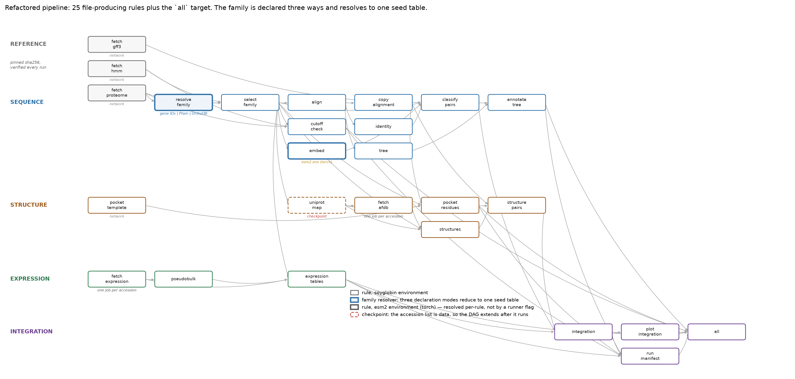

# The pipeline

29 rule statements in `workflow/Snakefile`: 25 that produce files, plus the
`all` target and three stage aliases (`sequence`, `structure`, `expression`)
that exist only to be named on the command line. The figure below predates the
`resolve_family` rule; regenerate it with the `--rulegraph` command below.

This document is the rule reference; the scientific reasoning is in `README.md`
and the pre-refactor audit that motivated this structure is in
`PIPELINE_AUDIT.md`.



## Running it

```bash
# everything, with per-rule conda environments materialised automatically
snakemake -s workflow/Snakefile --cores 8 --use-conda

# what is stale and why — answers the question the old runners could not
snakemake -s workflow/Snakefile --cores 1 -n --reason

# one stage
snakemake -s workflow/Snakefile --cores 8 --use-conda sequence
snakemake -s workflow/Snakefile --cores 8 --use-conda structure
snakemake -s workflow/Snakefile --cores 8 --use-conda expression

# one file
snakemake -s workflow/Snakefile --cores 4 --use-conda results/sequence_module/paralog_pairs.csv

# regenerate this figure
snakemake -s workflow/Snakefile --forceall --rulegraph | dot -Tpng > docs/pipeline_dag_snakemake.png

# the invariants
pytest -q tests/
```

Without `--use-conda` every rule runs in the active environment, which works for
all of them **except `embed`** — that one needs torch. Either use `--use-conda`,
or run the embedding step by hand in the `esm2` environment and let the workflow
pick the output up:

```bash
conda run -n esm2 python pipeline/steps.py embed \
    --faa results/sequence_module/globins.faa \
    --out-matrix results/sequence_module/esm2_cosine_distance_matrix.csv \
    --out-npz results/sequence_module/esm2_embeddings.npz
```

Each rule is one `pipeline/steps.py <step>` invocation, so any step can also be
run directly with `--help` to see its declared inputs and outputs.

## Configuration

`config/config.yaml` holds every family-specific value and every parameter that
changes an output. Nothing outside the `family:` block names a gene.

The config is a **hashed DAG input**. `pipeline/config.py` computes a stable
digest over it, each rule's `params` carries the digest of the section it
depends on, and `results/run_manifest.json` records the whole-config digest.
Editing `score:` re-runs scoring; editing `family.focal_genes` re-runs
everything downstream of the family search. Before this, changing the family
definition and re-running only module 4 produced a clean-looking table scored
against a different family, with nothing able to detect it.

`config.py` raises on a missing key rather than returning a default, so a
renamed field surfaces at first use instead of as a silent default deep inside a
computation. `validate()` additionally checks ranges, cross-references (every
configured tissue must be declared by some library; the pocket reference member
must exist in the family block) and regex validity.

Pointing the pipeline at another family is a new config file:

```bash
snakemake -s workflow/Snakefile --cores 8 --use-conda --configfile config/other_family.yaml
```

The identifier conventions (`family.identifiers`), the HMM accession, the pocket
template and its reference member, the expression series and its library table
all move with it. What does *not* generalise without code work is a different
reference genome's ID conventions beyond the two regexes, and a different
expression atlas format — both out of scope by decision.

## Declaring the family

The family can be declared three ways. `family.source` picks the mode,
`validate()` enforces that exactly one block is populated, and all three
resolve — in `pipeline/family.py`, via the `resolve_family` rule — to one seed
table (`results/sequence_module/family_seed.csv`). Nothing downstream of that
rule knows which mode was used.

| mode | declaration | `focal` |
| --- | --- | --- |
| `gene_ids` | an explicit gene set; the list **is** the family | implicit — all of them |
| `pfam` | an HMM search defines membership | **optional** |
| `orthodb` | an OrthoDB group, restricted to this species | **optional** |

```yaml
family:
  source: pfam
  pfam:
    accession: PF00042
    focal: [Glyma.10G199100, Glyma.10G199000]   # optional
```

Symbols are independent of the focal set: `family.symbols` names any member in
any mode, and a member with no symbol is labelled by bare gene ID.

**Naming a gene does not make it a member.** The seed carries `must_include`
separately from `symbol`, so a label cannot pull a gene into the family — two
runs with the same Pfam accession give the same membership regardless of which
symbols happen to be configured. Only `gene_ids` and `orthodb` force genes in.

### Omitting `focal`

Legal for `pfam` and `orthodb`, and it means *the whole discovered set is the
family, with no outgroup*. That is a different analysis, not a degenerate one,
and it changes two things.

**`focal_outgroup_separation` does not run.** There are no outgroup pairs to
separate from, so the check records itself `applicable: false` with a reason
and applies **no verdict** — whatever its configured policy. This is not the
same as passing, and the distinction is the reason `evaluate_check` grew an
`applicable` argument: reporting `passed: true` on an empty comparison would
turn a `policy: fail` gate into a silent green light, and the run would go
green on a check that never ran. The configured policy is left at `fail`, so
the same config on a family that *does* have an outgroup re-arms the gate with
no edit.

**`R_clade` does *not* become a duplicate of `R_family`.** This is the
inference that looks obvious and is wrong. The clade scope then covers the same
pairs, but it still rescales M and E *separately, each as a whole*, onto
`[clade_floor, 1]` — and rescaling the two factors independently changes their
relative contribution to the product. Measured on the committed family with no
focal subset: max absolute difference **0.146**, Spearman **0.635**, and the
rank order is **not** preserved. `R_clade` stays informative; what it loses is
the *reading* "relative within the ingroup, against a larger family". The
integration manifest measures this per run under
`family_composition.clade_vs_family` rather than asserting it.

Running `pfam` with `focal` omitted on PF00042 is therefore **not** a
reproduction of the committed leghemoglobin result: it gives 7 focal members
and 21 focal-focal pairs with no separation check. The committed result is
`source: gene_ids`.

### Scope: soybean only

`orthodb` resolves a group *within this assembly*. `species_taxon` must equal
`family.species.ncbi_taxon` and a mismatch fails at config load. The reference
proteome, the GFF, the identifier regexes and the entire expression atlas are
specific to one assembly, so resolving an orthogroup in another species would
need all of them replaced — the mode fails loudly rather than half-working.
`data.orthodb.org` is not on the sandbox network allowlist and needs granting.

### One work directory per family

`paths.work` holds intermediates keyed by nothing but their filename
(`work/phylo/globins.aln.faa`, `work/hmmer/<acc>.tblout`). Two configs that
point `paths.results` at different trees but leave `paths.work` at the default
therefore overwrite each other's intermediates, and each run silently
invalidates the other's downstream rules — the tables that get rebuilt are
correct, and the ones that do not are stale, with nothing in either output tree
saying so.

`resolve_family` stamps `work/.family_stamp.json` with the family digest and
fails if it changes:

```
work/ was last written by a different family definition.
  previous : gene_ids digest b25ed173154d -> results
  now      : pfam     digest c00b863ae355 -> results_pfam
```

So a second family needs its own `paths.work` (and the three cache paths under
it), not just its own `paths.results`.

### Re-running is a no-op, with one caveat

Once settled, re-invoking either config reports "Nothing to be done" and exits
0; verified over three interleaved rounds across two configs.

The caveat is `embed`. Without `--use-conda` it fails on the missing torch
import, and Snakemake deletes the outputs of a failed job — so the ESM2 matrix
disappears and the next run is not a no-op. Either run with `--use-conda` so
the rule gets its declared environment, or supply the matrix and `--touch` it.
Verification runs in this repo took the second route; it is declared wherever
those numbers are reported.

## Contracts

`pipeline/contracts.py` declares, for each table crossing a module boundary: the
required columns, their dtypes, nullability and bounds, key uniqueness, the
exact row count `C(n_members, 2)`, and the canonical `gene_a < gene_b`
orientation. Validation runs on **write** as well as on read, so an emitter that
produces a malformed table fails at the emitter rather than four steps later.

This generalises the one guard the repo already had. The defect it exists to
prevent is on record: two modules disagreed about whether one gene carries a
symbol, each enumerated pairs with its own `itertools.combinations`, and a naive
merge returned 11 of 21 rows and raised nothing. Every number downstream of a
short table is arithmetically valid and scientifically meaningless, which makes
it the worst failure mode available to this pipeline.

Specs are built *from the config* because several column names are
tissue-dependent (`cpm_mean_nodule`, `log2fc_mean_nodule`) and several are
library-dependent (`cpm_GSM7065810`).

Known-degenerate columns are declared, not documented: `spearman_profile` is
marked `degenerate` with its reason attached, so a consumer cannot pick it up by
accident.

### Renamed columns

The refactor renamed the columns that hardcoded the family into the schema.
Values are unchanged.

| pre-refactor | now |
| --- | --- |
| `top_lb_pair` | `top_focal_pair` |
| `top_lb_R` | `top_focal_R` |
| `lb_R_spread` | `focal_R_spread` |
| `pair_class == "Lb-Lb"` | `pair_class == "focal-focal"` |
| `col49_lba43` … | `col49_ref43` … |

`contracts.migrate_legacy_columns()` converts a pre-refactor table so it can be
read against a current spec — which is what the verification diff below uses.

## Checks and their policies

Every check is evaluated with its evidence recorded; `checks:` in the config
decides whether a failure stops the run. Previously all of these were printed
and the runner exited 0 regardless.

A check can also record itself **not applicable**, which applies no verdict
regardless of policy — see "Omitting `focal`" above. `applicable` is recorded
on every check row, so the manifest shows which gates were live for a run.

| check | policy | what it asserts |
| --- | --- | --- |
| `reference_checksums` | fail | each reference file matches its pinned sha256 |
| `hmm_release` | warn | InterPro served the expected Pfam release |
| `family_cutoff_gap` | fail | bit-score gap below the weakest accepted hit ≥ 25 |
| `alignment_columns` | warn | MSA column count unchanged |
| `afdb_model_version` | warn | AFDB model version unchanged |
| `model_vs_reference_sequence` | warn | each model matches the reference transcript, or is a declared exception |
| `pocket_residue_count` | fail | the crystal pocket has the expected residue count |
| `pocket_uniprot_crosscheck` | warn | ≥4 UniProt binding sites fall inside the transferred pocket |
| `library_total_counts` | warn | each library's summed counts unchanged |
| `pair_table_contracts` | fail | every pair table satisfies its schema |
| `pair_join_completeness` | fail | `C(n, 2)` pairs joined across all three modules |
| `focal_outgroup_separation` | fail | focal pairs separate from outgroup pairs |
| `directional_coverage_abundance` | fail | coverage direction tracks measured abundance |
| `symmetric_ranking_top` | **report** | which focal pair ranks top — measured, never asserted |

`symmetric_ranking_top` is deliberately `report`: the top two focal pairs are
0.011 apart and swap between α = 0.50 and 0.55, so the identity of the single
most redundant pair is not a claim this pipeline can make. It is recorded
without a pass condition rather than dropped.

## Provenance

Each step writes `results/.prov/<step>.json` with the sha256 of every input it
consumed and every output it produced, plus tool versions and the relevant
config digest. `run-manifest` collects them into `results/run_manifest.json`
and **cross-checks each recorded input digest against the file as it is now**,
listing any mismatch under `stale_inputs`.

That is what the four independent module manifests could not do. None of them
recorded the identity of the upstream outputs behind it, and there was no run
id, so two partial re-runs could not be told apart. Snakemake's own staleness
check is by mtime, which a `touch` or a checkout defeats; the digests are the
durable record.

## Caches

Caches live under `work/` and are copied into `results/`. Previously
`results/structure_module/pdb/` was both the AFDB download cache and a
deliverable, so clearing results to force a clean re-run also cleared the cache.

Cache keys are checksums, not presence:

- reference files — verified against the sha256 pinned in the config on every
  run, and re-downloaded on mismatch. SoyBase and InterPro both re-release
  under the same URL, so presence-based caching would silently accept a
  changed annotation.
- `work/expression/pseudobulk_counts.csv.gz` — keyed on the sha256 of every
  matrix and feature file it sums, recorded in a sidecar `.key.json`. It was
  keyed on the library *list*, so replacing a matrix on disk reused the stale
  summed table. A key mismatch rebuilds rather than raising: the inputs are the
  authority and a cache is only ever an optimisation.
- `work/structure/templates/pocket_<template>_<ligand>_<cutoff>.json` — keyed on
  the three values the pocket definition actually depends on, so a cutoff sweep
  does not re-download the crystal.
- `work/structure/afdb/` — keyed on accession, with the model version checked
  against the config.

## The two environments

`workflow/envs/soyglobin.yaml` covers every rule except one;
`workflow/envs/esm2.yaml` covers `embed`. torch pulls a large dependency set
that has no business constraining the bioconda solve for hmmer/mafft/iqtree.

Under `--use-conda` this is a per-rule directive rather than something the
operator has to remember — which is what the old runner's
`--skip-esm2` / `--reuse-esm2` flag pair was working around. The reuse path
recorded provenance as the sentence *"reused from a previous run (see that run's
manifest)"*; the embedding is now a rule with a declared environment and a real
output digest.

Both files are version-pinned. `environment.yml` left numpy/pandas/scipy/
biopython free while the manifests recorded tool versions as evidence, so the
recorded version and the committed numbers could drift apart with nothing
saying so.

**Weights download note.** ESM2 weights do not come from `huggingface.co`; they
come from `cas-server.xethub.hf.co` (Xet) or `us.aws.cdn.hf.co` (LFS fallback).
Behind an egress allowlist, allowing only `huggingface.co` fails at the weights
step *after* the config downloads, which looks like a corrupt cache rather than
a network policy. `HF_HUB_DISABLE_XET=1` forces the LFS route; the Rust Xet
client ignores HTTP proxies, the LFS one does not.

## Verification against the pre-refactor results

The workflow was re-run end to end against the on-disk inputs and every output
diffed against the tables committed at `a2dfe7e`.

| table | result |
| --- | --- |
| `globin_family_members.csv` | byte-identical |
| `pairwise_identity_{matrix,pairs}.csv` | byte-identical |
| `esm2_cosine_distance_matrix.csv` | byte-identical (reused, see below) |
| `structure_pairs.csv` | byte-identical |
| `gene_pseudobulk_profiles.csv` | all numeric values equal; `detection_rate_note` reworded |
| `expression_pairs.csv` | all numeric values equal; `coexpression_overlap_note` reworded |
| `marker_profiles.csv` | all numeric values equal; `marker_role` reworded |
| `gene_context.csv` | values equal (max abs diff 9.4e-38, an E-value near float underflow) |
| `paralog_pairs.csv` | values equal, max abs diff 0 |
| `redundancy_scores.csv` | values equal, max abs diff 0 |
| `weight_sensitivity.csv` | values equal after the column rename, max abs diff 0 |
| `pocket_residues.csv` | values equal; columns renamed `col*_lba*` → `col*_ref*`, `gene_id` added |
| `structures.csv` | all 18 shared columns equal after sorting on `label`; see below |
| `globins.treefile` | identical topology and identical support values; branch lengths differ in the 9th–10th decimal |

Three differences, all explained:

1. **`globins.treefile`** — same IQ-TREE version, same seed, same model, same
   support values (100/100, 79.7/70, 45.4/47, 31.1/39) and the same topology.
   Branch lengths differ at the 9th–10th decimal, which is floating-point
   non-determinism in numerical optimisation, not a parameter or data
   difference.
2. **`structures.csv`** — row order previously depended on the order two frames
   merged in and is now sorted on `label`; `uniprot_reviewed` is now a real
   boolean instead of the string `"reviewed"` (the contract's dtype); and
   `uniprot_release` and `resolution` are new provenance columns. The
   pre-refactor table also carried `uniprot_x`/`uniprot_y` merge suffixes
   because the accession column arrived from both sides of a join — the
   accession table is now a declared input with one `uniprot` column.
3. **`pocket_residues.csv`** — column names no longer embed the reference
   member's symbol, since which member the crystal numbering is transferred
   through is now configuration.
4. **The three expression tables** — the NA-reason strings and the marker-role
   descriptions now come from the config rather than being formatted in code, so
   their wording changed (`"not computable from pseudobulk (no cells)"` →
   `"per-cell quantity; pseudobulk has no cells"`). Every numeric value is
   unchanged; the reason is now editable next to the decision it explains.

**The ESM2 matrix was reused, not recomputed.** The `embed` rule is wired with
its own environment and was exercised as a rule, but a fresh run needs a ~2.5 GB
weights download; the committed fp32 CPU matrix was used instead and the
downstream tables are bit-identical against it. The step's dtype is now an
explicit parameter rather than inferred from the hardware, so an fp16 GPU run is
a declared difference instead of a silent one.

The relaxed-cutoff check, which was previously run by hand and written into
README §1.2 as prose, now reproduces those numbers as a rule output: weakest
accepted hit 63.2 bits, best rejected 13.5 bits (`Glyma.17G033600.3`), gap
**49.7** against a configured minimum of 25.

## Tests

`pytest -q tests/` — 37 tests, all on synthetic inputs or the committed tables,
no network. They cover the invariants this repo has already been bitten by:
canonical pair ordering (including that it is invariant to input order, and that
`core.canonical_pair_order` and `contracts.canonical_pairs` agree), the
`label_of` / `gene_from_label` round trip including for a member with no symbol,
the `C(n, 2)` row count and shared key set across all four pair tables, the
contracts rejecting a dropped row / reversed pair / NA in a required column /
duplicate key / out-of-range value, config validation rejecting seven classes of
bad config, digest stability and section isolation, and `tau` / `dose_ratio` /
`minmax` on inputs whose answers are known by hand.

These are not unit tests of the science. The science is checked against evidence
by the validation checks, which run inside the pipeline and are recorded in the
manifest.

## Not done

- **`dataset_diagnostic`** (audit 3.6) is declared in the config
  (`expression.dataset_diagnostic`) but has no rule. It is the comparison behind
  rejecting GSE270392 — the expression module's central design decision — and
  making it reproducible needs that series' matrices downloaded, which is a
  multi-GB fetch outside this refactor's scope. `published_protein_shares` is
  `null` so panel b would be dropped rather than plotted from uncited numbers.
  This remains the one step whose evidence is not reproducible.
- **Cell-type resolution** (README §5.1) — unchanged in scope; the config now
  carries `expression.resolution: pseudobulk` so moving to `cell_type` is a
  declared change rather than an undocumented one.
- **A lockfile.** The environments are version-pinned but not solved to a lock.
