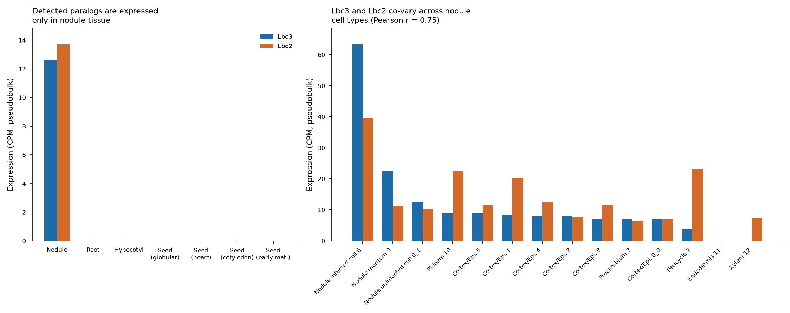

# Leghemoglobin paralog redundancy in soybean (GSE270392)

Tests whether the soybean leghemoglobin paralogs identified in
[OrthoDB group 706508at2759](../orthodb_706508at2759_leghemoglobin/) show
redundant (co-expressed) or specialized (mutually exclusive) expression
across tissues and cell types, using the single-cell/single-nucleus
multiomic soybean atlas [GSE270392](https://www.ncbi.nlm.nih.gov/geo/query/acc.cgi?acc=GSE270392)
(Zhang et al., *Cell* 2024, PMIDs 39005400 / 39742806).

## Gene ID mismatch (as flagged up front)

OrthoDB and GSE270392 use different soybean gene ID conventions, even
though both are built on the same Wm82.a4.v1 genome assembly:

| Source | ID example | Notes |
|---|---|---|
| OrthoDB (`pub_gene_id`) | `GLYMA_10G198800v4` or a bare placeholder (`N-50`, `N-2`) | Only 2 of 5 Glycine max records in the group carry a usable Glyma-style tag |
| GSE270392 matrices | `Glyma.10G198800` | Dot notation, no version suffix |
| GSE270392 Seurat objects | `ann1.Glyma.10G198800` | Same ID, with an extra annotation-source prefix |
| NCBI RefSeq (GCF_000004515.6 = Wm82.a4.v1) | Gene symbol `LB1`, GeneID `100527391` | No Glyma cross-reference in the feature table/GFF |

`code/map_leghemoglobin_ids.py` resolves all 5 OrthoDB records to Glyma IDs:
2 already carry a usable OrthoDB tag (direct reformat), and the other 3 are
resolved by (a) matching NCBI's `gene_synonym` field against OrthoDB's
placeholder tag (e.g. NCBI locus `LB2`'s synonyms include `N-50,Nodulin-50`,
exactly matching OrthoDB's `N-50`) and (b) BLASTP against SoyBase's
Wm82.a4.v1 protein database to obtain the exact Glyma locus tag. All 5 BLAST
hits are 100% full-length identity matches:

| OrthoDB record | Gene | Glyma ID (GSE270392) | NCBI GeneID |
|---|---|---|---|
| `GLYMA_10G198800v4` | Lbc3 (LB1) | `Glyma.10G198800` | 100527391 |
| `N-50` | Lbc1 (LB2) | `Glyma.10G199000` | 100785236 |
| `N-2` | Lba (LB3) | `Glyma.10G199100` | 100527427 |
| `GLYMA_20G191200v4` | Lbc2 (LB4) | `Glyma.20G191200` | 100527379 |
| `GLYMA_10G198900v4` ("hypothetical protein") | unnamed, adjacent to the cluster | `Glyma.10G198900` | -- (NCBI calls the overlapping locus a pseudogene, `LB5`, GeneID 100777546) |

## Data

GSE270392 profiled 10 soybean tissues by snRNA-seq/spRNA-seq and scATAC-seq.
`code/fetch_gse270392.py` downloads the 7 tissues for which GEO released a
pre-aggregated gene x cell-state pseudobulk RNA count matrix (Leaf and Pod
were profiled by scATAC-seq only, with no companion RNA matrix): early
nodule, root, hypocotyl, and four seed developmental stages (globular, heart,
cotyledon, early-maturation).

## Result: only 2 of 5 paralogs are detectable in this dataset, only in the nodule

| Paralog | Detected? | Where |
|---|---|---|
| Lbc3 (`Glyma.10G198800`) | Yes | Nodule only (0 CPM in all other 6 tissues) |
| Lbc2 (`Glyma.20G191200`) | Yes | Nodule only (0 CPM in all other 6 tissues) |
| Lbc1 (`Glyma.10G199000`) | No | Absent from every tissue's matrix |
| Lba (`Glyma.10G199100`) | No | Absent from every tissue's matrix |
| unnamed (`Glyma.10G198900`) | No | Absent from every tissue's matrix |

**This absence was verified, not assumed.** `code/modal_seurat_probe.py` runs
on Modal (the released per-tissue Seurat objects are several hundred MB to
low-GB once loaded, so this step needs real memory/compute) and downloads +
loads the full nodule Seurat object directly, checking gene presence in the
**unfiltered "RNA" assay** (40,127 genes -- the largest gene universe
released for this tissue, well beyond the 25,374-gene curated summary file).
Lbc1, Lba, and the unnamed locus are absent even there. This is a genuine
non-detection in the released single-nucleus data, not an artifact of the
pre-aggregated file or of the ID mapping. The most likely explanation is a
single-**nucleus** (rather than whole-cell) RNA-seq detection limit: mature,
highly abundant, largely intron-poor cytoplasmic transcripts such as
leghemoglobin mRNA are comparatively under-represented in nuclear preps, and
even the two paralogs that *are* detected register only ~200 total counts
across the ~12,600 nodule nuclei profiled -- consistent with near-threshold
capture, not high-abundance detection.

Because of this, **redundancy could only be tested between the two detected
paralogs (Lbc3 and Lbc2), and only across cell types within the nodule** --
the tissue-level comparison (nodule vs. everywhere else) has no ambiguity to
resolve, since both are undetectable everywhere outside the nodule.

## Redundancy test: Lbc3 vs. Lbc2 across nodule cell types

Pseudobulk CPM for both paralogs across the 14 annotated nodule cell states
(`code/redundancy_analysis.py`) shows:

- Both genes peak in `Nodule_infected_cell` (Lbc3: 63.4 CPM, Lbc2: 39.6 CPM),
  consistent with known nodule-infected-cell-specific leghemoglobin
  expression.
- Both show detectable "leaky" expression across several other nodule cell
  types (cortex/epidermis clusters, phloem, pericycle) at 4-23 CPM -- plausibly
  ambient RNA / doublet contamination typical of droplet-based snRNA-seq,
  though this dataset cannot distinguish that from low-level true expression.
- **Pearson r = 0.75 (CPM) / 0.79 (raw counts)** between Lbc3 and Lbc2 across
  the 14 cell states: strongly positively correlated but not perfectly
  redundant. Lbc2 is relatively more enriched outside the infected cell
  (e.g. Phloem, Pericycle) than Lbc3 is, meaning their relative usage isn't
  identical even though both are induced together in the same infected-cell
  program.



**Interpretation.** Among the paralogs this dataset can resolve, the
evidence points toward co-regulated, redundancy-consistent expression
(strong positive correlation, shared peak cell type) rather than
spatial/cell-type specialization. This is a partial answer: it does not
speak to Lba or Lbc1, which are known from classical biochemistry to be
expressed in soybean nodules but are not captured in this particular
single-nucleus release.

## Files

- `code/fetch_gse270392.py` -- downloads GEO series metadata and the 7
  per-tissue pseudobulk matrices.
- `code/map_leghemoglobin_ids.py` -- resolves all 5 OrthoDB Glycine max
  records to Glyma IDs (synonym lookup + SoyBase BLAST); writes
  `results/leghemoglobin_id_map.json`.
- `code/modal_seurat_probe.py` -- Modal job that loads the full per-tissue
  Seurat object and checks gene presence/counts in every assay.
- `code/redundancy_analysis.py` -- computes tissue- and cell-type-level CPM
  and the Lbc3/Lbc2 correlation; writes `results/tissue_level_cpm.csv`,
  `results/nodule_celltype_cpm.csv`, `results/redundancy_summary.json`.
- `results/leghemoglobin_redundancy.png` -- summary figure (above).

## Reproducing

```bash
python code/fetch_gse270392.py
python code/map_leghemoglobin_ids.py
python code/modal_seurat_probe.py <tissue_rds_gz_url> seurat_probe_result.json
python code/redundancy_analysis.py
```

`modal_seurat_probe.py` requires a Modal account and an authenticated
`modal` Python SDK (`MODAL_TOKEN_ID` / `MODAL_TOKEN_SECRET` env vars, or
`modal token new`), and builds its container image from the public
`satijalab/seurat` Docker image.
