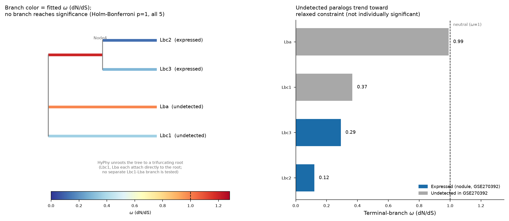

# Branch-site selection (HyPhy aBSREL) on the soybean leghemoglobin paralogs

Tests whether the soybean leghemoglobin paralogs from
[OrthoDB group 706508at2759](../orthodb_706508at2759_leghemoglobin/) show
evidence of episodic diversifying (positive) selection on any lineage, as a
sequence-level complement to the expression-based redundancy analysis in
[gse270392_leghemoglobin_redundancy/](../gse270392_leghemoglobin_redundancy/).
Alignment is codon-aware (PRANK); the branch-site test is HyPhy aBSREL
(Adaptive Branch-Site Random Effects Likelihood), run on the user's Modal
account for the alignment + selection-test compute.

## Scope: the soybean portion of the tree only

The full ML tree (197 taxa, all species) is restricted to just the 4
*Glycine max* leghemoglobin paralogs that have a valid coding sequence:
Lbc3 (`Glyma.10G198800`), Lbc1 (`Glyma.10G199000`), Lba (`Glyma.10G199100`),
Lbc2 (`Glyma.20G191200`). The fifth OrthoDB Glycine max record in this group
(`Glyma.10G198900`) is annotated as a pseudogene by NCBI RefSeq (no CDS
feature) and is excluded from this codon-based test -- consistent with the
GSE270392 expression analysis, where it was also undetected.

`code/prune_tree.py` extracts this 4-tip induced subtree directly from the
original IQ-TREE ML tree (`../orthodb_706508at2759_leghemoglobin/results/tree_706508at2759.treefile`),
preserving its topology:

```
((Lbc1, Lba), (Lbc3, Lbc2))
```

**This recovers the same pairing found independently by the expression
analysis**: Lbc3 and Lbc2 -- the dosage-balanced, co-expressed pair
(Benoit et al. group I) -- are sister paralogs from a more recent gene-tree
split, distinct from the Lbc1/Lba pair, which is undetected in GSE270392.

## Pipeline

1. `code/fetch_soybean_cds.py` -- fetches the CDS nucleotide sequence for
   each of the 4 paralogs from NCBI RefSeq (via each gene's mRNA accession),
   and validates that its translation matches the corresponding OrthoDB
   protein record (3 of 4 match exactly; Lbc3's RefSeq transcript carries one
   documented 1-residue substitution relative to the genomic sequence, per
   NCBI's own annotation note).
2. `code/prune_tree.py` -- prunes the full 197-taxon ML tree to these 4 tips.
3. `code/modal_absrel.py` -- runs, as a Modal Function on the user's Modal
   account (image: Miniconda + bioconda `prank`+`hyphy`):
   - **PRANK** (`-codon -F`, guided by the pruned tree) for a codon-aware
     multiple alignment of the 4 CDSs;
   - **HyPhy aBSREL** on that alignment + tree, testing all 5 branches for
     episodic diversifying selection. HyPhy analyzes the tree unrooted, which
     collapses our 4-taxon rooted guide tree into a **trifurcating root**:
     Lbc1 and Lba each attach directly to the root as separate terminal
     branches, and the third root branch ("Node4") leads to the (Lbc3, Lbc2)
     clade. There is therefore no separate Lbc1-Lba branch in the tested
     tree -- the one internal branch tested (Node4) is specifically the
     ancestral branch of the (Lbc3, Lbc2) pair. This is read directly from
     aBSREL's own recorded input tree (`absrel_result["input"]["trees"]`),
     not assumed from the guide tree's topology.
4. `code/plot_absrel_selection.py` -- renders the interpretation figure below.

## Results

| Branch | Fitted $\omega$ (dN/dS) | Corrected p-value | Expressed in GSE270392? |
|---|---|---|---|
| Lbc2 (`Glyma.20G191200`) | 0.12 | 1.0 | Yes (nodule) |
| Lbc3 (`Glyma.10G198800`) | 0.29 | 1.0 | Yes (nodule) |
| Lbc1 (`Glyma.10G199000`) | 0.37 | 1.0 | No |
| Lba (`Glyma.10G199100`) | 0.99 | 1.0 | No |
| Node4 (ancestral branch of the Lbc3+Lbc2 clade) | 1.20 | 1.0 | -- |

**Holm-Bonferroni-corrected likelihood-ratio test for episodic diversifying
positive selection: 0 of 5 branches significant** (p = 0.05 threshold). No
paralog shows statistically detectable positive selection on this tree.



**Interpretation, with the caveat that none of this reaches significance**:
all 4 terminal branches sit at $\omega$ < 1 (purifying selection) except Lba,
which is essentially at the neutral threshold ($\omega$ = 0.99). Read
qualitatively, the omega ranking lines up with the expression-based
redundancy result: the two expressed, dosage-balanced paralogs (Lbc2, Lbc3)
show the strongest purifying constraint (lowest $\omega$) on their terminal
branches, while the two undetected paralogs (Lbc1, and especially Lba) trend
toward weaker constraint -- consistent with (though not proof of) a
degeneration trajectory paralleling their loss of detectable expression. The
highest $\omega$ (1.20, just above the neutral threshold) is on Node4, the
ancestral branch leading specifically to the (Lbc3, Lbc2) clade -- i.e. the
branch immediately preceding the split that produced the two paralogs that
*are* co-expressed and dosage-balanced today. That would be consistent with a
brief period of relaxed constraint or positive selection around that
particular duplication event, rather than around the deeper split separating
the Lbc1/Lba lineage -- but this, too, is not statistically significant, and
no equivalent internal branch for the Lbc1/Lba pair exists in the tested
(unrooted, trifurcating) tree to compare against.

**This analysis has essentially no statistical power** to detect selection at
this scale: aBSREL is a likelihood-ratio test whose power scales with the
number of sequences/branches and their sequence divergence, and 4 short,
$\geq$96% identical coding sequences is about as underpowered a design as this
test admits. The consistent direction of the omega gradient across
independent branches is suggestive and worth following up (e.g. with the
remaining 193-taxon context restored, or additional legume orthologs), but
should not be read as a positive finding on its own.

## Files

- `code/fetch_soybean_cds.py` -- fetches and validates the 4 paralogs' CDS.
- `code/prune_tree.py` -- prunes the full ML tree to the 4-taxon subtree.
- `code/modal_absrel.py` -- Modal Function: builds the PRANK+HyPhy image,
  runs the codon alignment and aBSREL test.
- `code/plot_absrel_selection.py` -- builds the interpretation figure.
- `results/leghemoglobin_gmax_cds.fasta`, `leghemoglobin_gmax_cds_metadata.json` --
  the 4 CDS sequences and their provenance/validation.
- `results/leghemoglobin_gmax_pruned.nwk` -- the 4-taxon guide tree.
- `results/leghemoglobin_gmax_aligned_codon.fasta` -- PRANK's codon alignment.
- `results/absrel_result.json` -- full HyPhy aBSREL output.
- `results/absrel_modal_result.json` -- the Modal job's full return payload
  (includes PRANK/HyPhy stdout/stderr).
- `results/leghemoglobin_absrel_selection.png` -- summary figure (above).

## Reproducing

```bash
python code/fetch_soybean_cds.py
python code/prune_tree.py ../orthodb_706508at2759_leghemoglobin/results/tree_706508at2759.treefile leghemoglobin_gmax_pruned.nwk
python code/modal_absrel.py leghemoglobin_gmax_cds.fasta leghemoglobin_gmax_pruned.nwk absrel_modal_result.json
python code/plot_absrel_selection.py absrel_modal_result.json leghemoglobin_absrel_selection.png
```

`modal_absrel.py` requires a Modal account and an authenticated `modal`
Python SDK (`MODAL_TOKEN_ID` / `MODAL_TOKEN_SECRET` env vars, or
`modal token new`); it builds its own image (Miniconda + bioconda `prank` and
`hyphy`) on first run.
