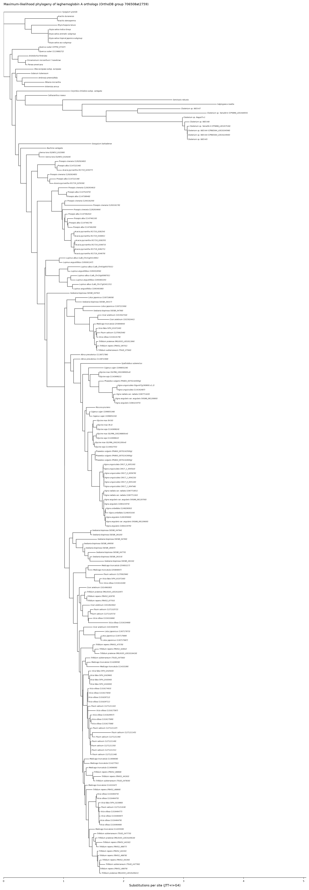

# OrthoDB group 706508at2759 — leghemoglobin A phylogeny

Maximum-likelihood phylogenetic tree of the **leghemoglobin A** orthologous
group (OrthoDB v11/v12 id `706508at2759`, Eukaryota level), built with
MAFFT + IQ-TREE 2 dispatched as a [Modal](https://modal.com) Function.

## Data

- **Source:** [OrthoDB REST API](https://www.orthodb.org/) —
  `https://data.orthodb.org/current/group?id=706508at2759` (group metadata)
  and `.../fasta?id=706508at2759` (member protein sequences).
- **Group:** leghemoglobin A, 197 gene sequences across 57 species in the
  fetched/aligned dataset (28 single-copy, 29 multi-copy — counted directly
  from `results/group_706508at2759_clean.fasta`). OrthoDB's whole-database
  phyletic profile for this group reports a larger footprint (present in 59
  species, 30 single-copy/29 multi-copy across the full database), which
  does not exactly match the 57-species set actually returned by the
  `fasta` endpoint and used to build this tree. Leghemoglobins are legume
  oxygen-carrier globins expressed in nitrogen-fixing root nodules; the
  group here also pulls in a non-legume globin/protoglobin homolog used by
  OrthoDB as outgroup context (*Salpingoeca rosetta*).

## Pipeline

1. `code/fetch_orthodb_group.py` — fetches the group FASTA from OrthoDB and
   rewrites headers into unique, Newick-safe tip labels
   (`Organism_name__odb_id`).
2. `code/build_and_run_modal.py` — defines a Modal `App`/`Function` running
   on a Debian-slim CPU image (`apt-get install mafft iqtree`) that:
   - aligns the sequences with `mafft --auto`;
   - infers the ML tree with `iqtree2 -m MFP -bb 1000 -alrt 1000` (ModelFinder
     model selection + 1000 ultrafast-bootstrap + 1000 SH-aLRT replicates).
   The function runs on the user's own Modal account (`modal.App(...)`,
   `@app.function(...)`, invoked via `.remote()`); no GPU is needed for a
   single-gene-family alignment/tree at this scale (4 vCPU / 4 GB, ~17 min
   wall time for the tree search).
3. `code/render_tree_figure.py` — renders the resulting Newick tree as a
   labeled phylogram (organism name per tip; a gene-id suffix disambiguates
   in-paralogs from multi-copy species).

## Results

- **Alignment:** 197 sequences, 635 amino-acid sites (`results/aligned_706508at2759.fasta`).
- **Best-fit model (BIC):** JTT+I+G4.
- **Tree files:**
  - `results/tree_706508at2759.treefile` — best ML tree, branch support as
    `SH-aLRT/ultrafast-bootstrap` at internal nodes.
  - `results/tree_706508at2759.contree` — majority-rule consensus of the
    UFBoot trees.
  - `results/tree_706508at2759.iqtree` — full IQ-TREE report (model
    selection table, log-likelihood, support values).
  - `results/tree_706508at2759.log` — full IQ-TREE run log.
- **Figure:** `results/tree_706508at2759_full.png`.



## Reproducing

```bash
python code/fetch_orthodb_group.py 706508at2759 group_706508at2759_clean.fasta
python code/build_and_run_modal.py group_706508at2759_clean.fasta 706508at2759
python code/render_tree_figure.py tree_706508at2759.treefile \
    group_706508at2759_clean.fasta tree_706508at2759_full.png
```

`build_and_run_modal.py` requires a Modal account and an authenticated
`modal` Python SDK (`MODAL_TOKEN_ID` / `MODAL_TOKEN_SECRET` env vars, or
`modal token new`).
