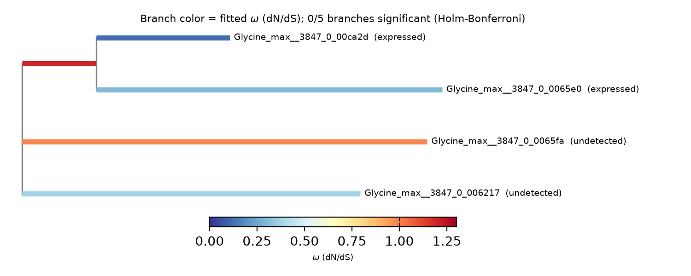

# OrthoDB paralog-redundancy pipeline (generalized, soybean-scoped)

Generalizes the leghemoglobin (OrthoDB group `706508at2759`) analysis in
[`orthodb_706508at2759_leghemoglobin/`](../orthodb_706508at2759_leghemoglobin/),
[`gse270392_leghemoglobin_redundancy/`](../gse270392_leghemoglobin_redundancy/),
and [`leghemoglobin_absrel_selection/`](../leghemoglobin_absrel_selection/)
into a reusable pipeline for **any** OrthoDB group id, packaged as a Claude
skill (`skill/`) plus standalone CLI scripts (`code/`) that work outside a
Claude Science session too.

## Scope

- **Stage 1 (fetch) and Stage 2 (MAFFT + IQ-TREE tree)** are fully
  species-agnostic -- any OrthoDB group id works.
- **Stage 3 (expression) and Stage 4 (branch-site selection)** assume
  **soybean** (*Glycine max*): they use the GSE270392 soybean multiomic
  atlas and SoyBase/NCBI RefSeq for ID resolution. Pass any group id --
  these stages skip cleanly, with a stated reason, if the group has no
  *Glycine max* records, or if none resolve to usable expression/CDS data.

## Pipeline stages

1. **Fetch** (`code/orthodb_fetch.py`) -- OrthoDB group metadata + FASTA,
   cleaned into unique Newick-safe labels.
2. **Tree** (`code/build_tree_modal.py`) -- MAFFT alignment + IQ-TREE 2 ML
   tree (ModelFinder, 1000 UFBoot, 1000 SH-aLRT), on Modal.
3. **Soybean expression** (`code/soybean_expression.py`) -- resolves each
   *Glycine max* record to a `Glyma.##G######` locus id (direct OrthoDB tag,
   else BLASTP against SoyBase's Wm82.a4.v1 protein database), fetches the
   GSE270392 per-tissue pseudobulk matrices, and computes: tau
   (tissue-specificity), expression breadth, non-functional/tissue-specific
   calls, the Benoit et al. (2025) 4-group coexpression/log2FC pair
   classification, and Pearson/Spearman/log2FC across all annotated cell
   types -- for every pair of detected paralogs, not just one hardcoded pair.
4. **Soybean selection** (`code/soybean_selection.py` + `code/modal_absrel.py`)
   -- resolves a CDS for each Glyma-ID-mapped paralog via
   `Glyma ID -> GLYMA_##G######vN tag -> NCBI gene esearch -> GeneID ->
   elink gene_nuccore_refseqrna -> mRNA accession -> efetch CDS` (no
   genome-wide GFF download needed), prunes the ML tree to those taxa, and
   runs PRANK (codon-aware alignment) + HyPhy aBSREL (branch-site selection)
   on Modal.
5. **Report** (`code/report.py`) -- a branch-omega figure (colored by fitted
   $\omega$, tips annotated by expression-detection status) and a Markdown
   summary.

## Regression reference: group 706508at2759 (leghemoglobin A)

Running the generalized pipeline against the same group analyzed manually
earlier in this project reproduces every previously-verified number exactly:

- 197 sequences / 57 species fetched.
- Glyma ID resolution: `Glyma.10G198900` (direct tag, later found to have no
  RefSeq mRNA -- a pseudogene), `Glyma.10G198800` (direct tag), `Glyma.20G191200`
  (direct tag), `Glyma.10G199000` and `Glyma.10G199100` (both resolved via
  BLASTP, not direct tags).
- 2 of 5 paralogs detected in GSE270392 (Lbc3 = `Glyma.10G198800`, Lbc2 =
  `Glyma.20G191200`), both nodule-restricted.
- Benoit et al. classification for the Lbc3/Lbc2 pair: **Group I, dosage
  balanced** (rank-standardized coexpression 0.9447, mean \|log2FC\| 0.7565,
  sd \|log2FC\| 0.7264) -- matches the manually-computed values exactly.
- CDS resolution: 4 of 5 paralogs have a resolvable mRNA (the pseudogene
  correctly has none); one (Lbc3) shows the same documented 1-residue RefSeq
  curation difference from its OrthoDB protein record found earlier.
- aBSREL: 0/5 branches significant (Holm-Bonferroni p=1 throughout); omega
  ranking Lbc2 0.1196 < Lbc3 0.2917 < Lbc1 0.3672 < Lba 0.9899 < Node4 1.1981
  -- identical to the manually-run analysis, including the corrected
  topology (Node4 is the ancestral branch of the Lbc3/Lbc2 clade, read
  directly from HyPhy's own recorded input tree rather than assumed from the
  guide tree).



## Where each stage runs (important sandbox note)

Stages 1, 3, and the CDS/tree-pruning half of stage 4 are pure Python
(urllib + pandas/numpy/scipy/Biopython). **Stages 2 and 4's actual Modal
dispatch must run via a shell invocation, not a direct Python
`subprocess` call from a long-running interpreter session** -- in the
Claude Science sandbox this project was built in, spawning the user's
Modal-authenticated Python binary via `subprocess` is blocked from the
persistent Python kernel but works from a one-shot shell command; the skill
version of this pipeline (`skill/`) documents this explicitly and provides
`prepare_tree_build_command` / `prepare_selection_command` helpers that
return the exact command to run. Running `code/pipeline.py` as a plain CLI
script (outside that sandbox) does not have this restriction.

## Usage

As a Claude skill: load `skill({skill: "orthodb-paralog-pipeline"})` in a
Claude Science session -- see `skill/SKILL.md` for the full call sequence.

As a standalone CLI (outside Claude Science, with `modal` importable
directly):

```bash
python code/pipeline.py <orthodb_group_id> <output_dir>
```

Requires a Modal account and an authenticated `modal` Python SDK
(`MODAL_TOKEN_ID` / `MODAL_TOKEN_SECRET` env vars, or `modal token new`).
