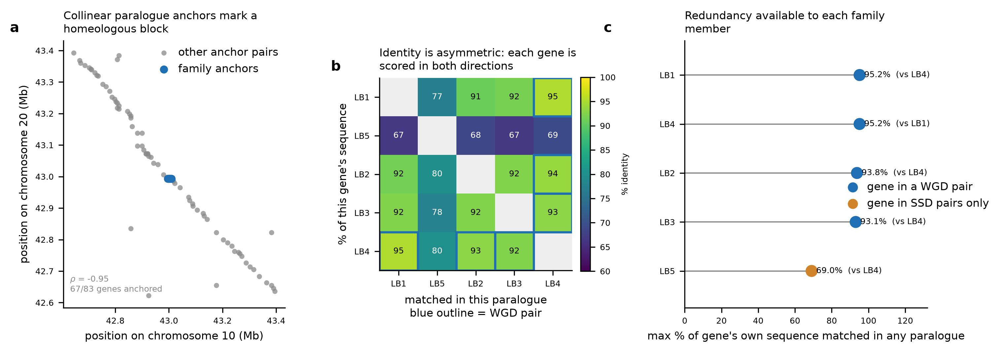

# Paralog redundancy of the soybean leghemoglobin gene family

Implementation of the paralog-redundancy quantification of **De Kegel B, Ryan CJ (2019),
"Paralog buffering contributes to the variable essentiality of genes in cancer cell lines",
PLoS Genetics 15:e1008466** (doi:10.1371/journal.pgen.1008466), applied to the leghemoglobin
(*Lb*) family of *Glycine max*.

## The method, as specified in the source study

From the paper's Methods ("Paralog data", "Whole genome vs. small-scale duplicates"):

1. Paralog relationships are taken from Ensembl Compara.
2. For each pair, protein sequence identity is retrieved **in both directions** — the percent of
   gene A's sequence matched in gene B, and the percent of B's matched in A. The two values differ
   because the proteins differ in length.
3. Pairs are retained only if they share **>=20% identity in both directions** and both genes are
   protein-coding.
4. Each gene is then summarised by (i) **the number of paralog pairs it belongs to** and
   (ii) **the maximum percent of its own protein sequence matched in any of its paralogs**.
   Genes absent from this summary are singletons.
5. Each pair is labelled **WGD** (whole-genome duplicate) or **SSD** (small-scale duplicate).
   A gene is marked WGD if it belongs to *any* WGD pair, even if it is also in SSD pairs.

## How each step was instantiated for soybean

| Step | Source study (human) | This implementation (*G. max*) |
|---|---|---|
| Paralog relationships | Ensembl 93, GRCh38 | Ensembl Plants Compara, `Glycine_max_v2.1`, REST `/homology/id/glycine_max/...?type=paralogues` |
| Bidirectional identity | Ensembl `perc_id`, both directions | identical — Compara returns `perc_id` for source and target of every homology |
| >=20% both directions, protein-coding | HGNC biotype | Ensembl `biotype == protein_coding` |
| Per-gene summary | pair count, max % own sequence matched | identical |
| WGD vs SSD | membership of two curated human ohnolog lists (Makino & McLysaght 2010; Singh et al. 2015) | **adapted** — no ohnolog list exists for *G. max*, so the criterion those lists are built on (synteny comparison) was reproduced locally and required to be concordant with the Compara duplication node |

### The WGD/SSD adaptation

The human ohnolog lists the paper consumes are themselves synteny-based, so the same criterion was
computed directly:

* Protein-coding genes within +/-400 kb of the chromosome-10 *Lb* cluster (87 genes) and of *LB4* on
  chromosome 20 (83 genes) were retrieved, and Compara paralogues were fetched for every gene in the
  chromosome-20 window.
* **67 of 83** chromosome-20 window genes have a paralogue inside the chromosome-10 window
  (76 anchor relations), and the anchors are collinear (Spearman rho = -0.95; negative because the
  two blocks are in opposite orientation). Of the 207 paralogues these genes have anywhere on
  chromosome 10, 76 fall inside the 800-kb window. The two loci are therefore homeologous — a
  retained block of the *Glycine*-lineage whole-genome duplication.
* A pair was called **WGD** only if it spans that homeologous block **and** Compara maps its
  duplication to the `Glycine_subgen._Soja` node, i.e. the divergence is no older than the WGD.
  This second condition matters: *LB5*-*LB4* spans the block but its duplication node is
  `Phaseoleae`, so the two genes had already separated before the WGD and the pair is an
  out-paralog, not an ohnolog. Synteny alone would have mislabelled it.

## Results

### Per-gene redundancy features (the paper's summary statistics)

| symbol   | synonym   | gene            |   chrom |   protein_len_aa |   n_paralog_pairs |   max_perc_id_own_seq | closest_paralog   |   mean_perc_id_own_seq | dup_mode   |   n_wgd_pairs |   n_ssd_pairs |
|:---------|:----------|:----------------|--------:|-----------------:|------------------:|----------------------:|:------------------|-----------------------:|:-----------|--------------:|--------------:|
| LB1      | Lbc3      | GLYMA_10G198800 |      10 |              145 |                 4 |               95.1724 | LB4               |                88.7931 | WGD        |             1 |             3 |
| LB4      | Lbc2      | GLYMA_20G191200 |      20 |              145 |                 4 |               95.1724 | LB1               |                90.1724 | WGD        |             3 |             1 |
| LB2      | Lbc1      | GLYMA_10G199000 |      10 |              144 |                 4 |               93.75   | LB4               |                89.4097 | WGD        |             1 |             3 |
| LB3      | Lba       | GLYMA_10G199100 |      10 |              144 |                 4 |               93.0556 | LB4               |                88.8889 | WGD        |             1 |             3 |
| LB5      | Lb5       | GLYMA_10G198900 |      10 |              168 |                 4 |               69.0476 | LB4               |                67.7083 | SSD        |             0 |             4 |

### Paralog pairs

| symbol_A   | symbol_B   |   perc_id_A_in_B |   perc_id_B_in_A |   min_perc_id | duplication_node     | dup_mode   | arrangement                     |
|:-----------|:-----------|-----------------:|-----------------:|--------------:|:---------------------|:-----------|:--------------------------------|
| LB1        | LB5        |          77.2414 |          66.6667 |       66.6667 | Phaseoleae           | SSD        | tandem, 0 intervening gene(s)   |
| LB1        | LB2        |          91.0345 |          91.6667 |       91.0345 | Glycine_subgen._Soja | SSD        | tandem, 1 intervening gene(s)   |
| LB1        | LB3        |          91.7241 |          92.3611 |       91.7241 | Glycine_subgen._Soja | SSD        | tandem, 2 intervening gene(s)   |
| LB1        | LB4        |          95.1724 |          95.1724 |       95.1724 | Glycine_subgen._Soja | WGD        | homeologous block (chr10/chr20) |
| LB5        | LB2        |          68.4524 |          79.8611 |       68.4524 | Phaseoleae           | SSD        | tandem, 0 intervening gene(s)   |
| LB5        | LB3        |          66.6667 |          77.7778 |       66.6667 | Phaseoleae           | SSD        | tandem, 1 intervening gene(s)   |
| LB5        | LB4        |          69.0476 |          80      |       69.0476 | Phaseoleae           | SSD        | homeologous block (chr10/chr20) |
| LB2        | LB3        |          92.3611 |          92.3611 |       92.3611 | Glycine_subgen._Soja | SSD        | tandem, 0 intervening gene(s)   |
| LB2        | LB4        |          93.75   |          93.1034 |       93.1034 | Glycine_subgen._Soja | WGD        | homeologous block (chr10/chr20) |
| LB3        | LB4        |          93.0556 |          92.4138 |       92.4138 | Glycine_subgen._Soja | WGD        | homeologous block (chr10/chr20) |

`perc_id_A_in_B` is the percent of gene A's own sequence matched in B, and vice versa.

### What the numbers say

* Ensembl Plants places the five leghemoglobins in a **single closed paralog clique**: every gene is
  in 4 pairs, all 10 pairs clear the >=20%-both-directions filter, so no gene is a singleton and the
  family-size feature is uniform across the family.
* **Redundancy is high but unevenly distributed.** *LB1*, *LB4*, *LB2* and *LB3* each retain a backup
  copy matching 93-95% of their own sequence, far above the medians the source study reports for its
  human essentiality classes (~42-48%). *LB5* is the outlier at 69.0%.
* **The asymmetry the bidirectional step exists to capture is real here.** *LB5* encodes a 168-aa
  protein against 144-145 aa for the others, so 80.0% of *LB4*'s sequence is matched in *LB5* while
  only 69.0% of *LB5*'s is matched in *LB4*. A single symmetric identity value would have assigned
  this pair one redundancy level instead of two.
* **Duplication mode splits 3 WGD / 7 SSD pairs.** The chromosome-10 array (*LB1*, *LB5*, *LB2*,
  *LB3* in coordinate order, spanning 15.2 kb with 0-2 intervening genes) is tandem, hence SSD;
  the WGD pairs are *LB4* against *LB1*, *LB2* and *LB3*. At gene level four of five genes are
  WGD-marked and only *LB5* is SSD-only. The arrangement is consistent with one ancestral locus
  duplicated by the WGD and the chromosome-10 copy subsequently amplified in tandem, with *LB5*
  descending from an older, pre-WGD duplication.

## Scope and caveats

* This implements the **redundancy-quantification half** of the source study. The other half — the
  association between these features and variable gene essentiality, and the synthetic-lethality
  inference — requires loss-of-function fitness screens across many genetic backgrounds. No such
  resource exists for soybean, so no essentiality or buffering claim is made here: the features
  describe redundancy *potential*, not measured functional compensation.
* Family membership is Ensembl Compara's, exactly as the source study takes it. Compara reports no
  paralogy between the leghemoglobins and the soybean non-symbiotic hemoglobins
  (*GLB1-1*/`GLYMA_11G121700`, *GLB1-2*/`GLYMA_11G121800`, which form their own pair at the
  `NPAAA_clade` node) or the 2-on-2 hemoglobins, so those genes fall outside the family as defined
  and are not in the tables. A family definition built from a globin-wide HMM or gene tree would be
  broader.
* Only protein-coding loci enter the analysis, per the paper's filter; documented *Lb* pseudogenes
  are therefore excluded.
* `dn_ds` is not populated for *G. max* in Ensembl Plants, so no selection statistic was computed.
* Duplication-node labels are Compara gene-tree inferences, not dated divergence estimates.

## Data sources

* Ensembl Plants REST API (`rest.ensembl.org`), data release 80, assembly `Glycine_max_v2.1`
  (GCA_000004515.4), genebuild 2018-08-JGI.
* Gene symbol / synonym / accession mapping from UniProtKB (taxon 3847, reviewed entries).

## Files

* `examples/soybean_leghemoglobin/gene_redundancy.csv` — per-gene redundancy features.
* `examples/soybean_leghemoglobin/paralog_pairs.csv` — all 10 pairs with bidirectional identity, duplication node and mode.
* `examples/soybean_leghemoglobin/synteny_anchors_chr10_chr20.csv` — the 76 chromosome-20 / chromosome-10 anchor relations supporting the WGD call.
