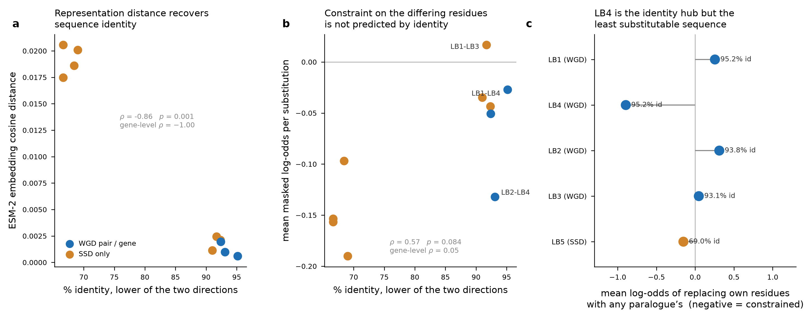

# Sequence-to-function divergence of the soybean leghemoglobins, compared with sequence-identity redundancy

Two model-based measures of functional divergence computed with **ESM-2 650M**
(`esm2_t33_650M_UR50D`; Lin et al. 2023, Science 379:1123), set against the paralog-redundancy
features of **De Kegel & Ryan 2019** (PLoS Genet 15:e1008466) already computed for this family.

## What was computed

**1. Representation divergence.** Mean-pooled final-layer (33) embedding per protein, pairwise
cosine distance. The conventional "how alike are these two proteins to the model" measure.

**2. Substitution constraint.** For an ordered pair A -> B, the proteins are globally aligned
(BLOSUM62, gap open -11 / extend -1) and at every position where they differ the masked-marginal
log-odds is computed *in A's own context*:

    s = log P(B_residue | A, position masked) - log P(A_residue | A, position masked)

This is the Meier et al. 2021 (NeurIPS) variant-effect score applied to the substitutions that
actually separate two paralogs. **More negative = greater predicted functional divergence**: the
differences sit at positions where the model strongly prefers the resident residue. Summed over
differing positions it measures total burden; averaged, it measures per-substitution severity.
203 masked forward passes, CPU, 8 min.

Crucially, measure 2 is *not* a function of percent identity: identity counts how many positions
differ, while the log-odds asks how much the model minds each one.

## Results

### Pair level

| pair    |   min % id | dup_mode   |   n subs |   embed cos dist |   mean LLR |   summed LLR |
|:--------|-----------:|:-----------|---------:|-----------------:|-----------:|-------------:|
| LB1-LB4 |    95.1724 | WGD        |        7 |         0.000589 |    -0.0272 |      -0.381  |
| LB2-LB4 |    93.1034 | WGD        |        9 |         0.000971 |    -0.1322 |      -2.3792 |
| LB3-LB4 |    92.4138 | WGD        |       10 |         0.001948 |    -0.0508 |      -1.0162 |
| LB2-LB3 |    92.3611 | SSD        |       11 |         0.002108 |    -0.0436 |      -0.9603 |
| LB1-LB3 |    91.7241 | SSD        |       11 |         0.002435 |     0.0166 |       0.3657 |
| LB1-LB2 |    91.0345 | SSD        |       12 |         0.001127 |    -0.0349 |      -0.8369 |
| LB5-LB4 |    69.0476 | SSD        |       29 |         0.020076 |    -0.1902 |     -11.0336 |
| LB5-LB2 |    68.4524 | SSD        |       29 |         0.018594 |    -0.097  |      -5.6283 |
| LB1-LB5 |    66.6667 | SSD        |       33 |         0.017465 |    -0.1536 |     -10.135  |
| LB5-LB3 |    66.6667 | SSD        |       32 |         0.020555 |    -0.1568 |     -10.0354 |

### Gene level

| symbol   |   max % own seq matched | closest (identity)   |   min embed cos dist | closest (ESM-2)   |   mean own-context LLR | dup_mode   |
|:---------|------------------------:|:---------------------|---------------------:|:------------------|-----------------------:|:-----------|
| LB1      |                 95.1724 | LB4                  |             0.000589 | LB4               |                 0.2548 | WGD        |
| LB4      |                 95.1724 | LB1                  |             0.000589 | LB1               |                -0.8953 | WGD        |
| LB2      |                 93.75   | LB4                  |             0.000971 | LB4               |                 0.311  | WGD        |
| LB3      |                 93.0556 | LB4                  |             0.001948 | LB4               |                 0.0467 | WGD        |
| LB5      |                 69.0476 | LB4                  |             0.017465 | LB1               |                -0.1521 | SSD        |

## How the two approaches compare

**The embedding distance is a restatement of percent identity.** Spearman rho =
-0.863 (p = 0.0013) against the De Kegel identity feature across the
10 pairs, and **rho = -1.000** at gene level — a perfect monotone inversion over
five genes. Substitution count tracks identity at rho = -0.991. At 93-95% identity a protein
language model's representation space contains no information that the identity feature did not
already carry, so as a redundancy measure it is a more expensive way to compute the same ranking.

**The constraint measure is orthogonal to identity, and that is where the model earns its place.**
Per-substitution severity correlates with identity only at rho = 0.571
(p = 0.0844), and at gene level not at all: rho = 0.051
(p = 0.9347). Concretely:

* **LB2-LB4** is the second-most-similar pair in the family (93.1% identity, 9 substitutions) yet
  carries a per-substitution severity of -0.1322 —
  comparable to the LB5 pairs at 67-69% identity — and a summed burden of
  -2.38 against
  -0.38 for LB1-LB4, a six-fold difference
  on two extra substitutions. Identity treats these two WGD pairs as near-equivalent; the model
  does not.
* **LB1-LB3** is the only pair with a *positive* mean log-odds
  (+0.0166): the model marginally prefers
  each protein's residues in the other's context, i.e. the 11 differences look tolerated.
* **LB4 is the identity hub but the least substitutable sequence.** LB4 is the closest paralog of
  LB1, LB2 and LB3 by identity, which under the De Kegel features makes it the family's redundancy
  anchor. In its own context, though, replacing LB4's residues with any paralog's scores
  -0.8953 — the most negative in the
  family, against +0.3110 for LB2. The
  asymmetry is directional and constraint-driven, unlike the length-driven asymmetry the
  bidirectional identity feature captures.

**Nearest-neighbour assignments agree for 4 of 5 genes.** The exception is LB5, whose closest
paralog is LB4 by identity (69.0% of its own sequence matched) but LB1 by embedding distance
(cosine 0.017465).

**Bottom line.** The two approaches answer different questions. De Kegel & Ryan's features ask
*how much backup sequence exists*, and the language model reproduces that almost exactly — so it
neither confirms nor adds to the redundancy call. What it adds is *where the remaining differences
fall*: LB2-LB4 and LB1-LB4 are interchangeable on identity but not on predicted constraint, and
LB4's own residues are the hardest to swap out despite it being every other gene's nearest
neighbour. If the goal is ranking which paralog pairs are most likely to be functionally
interchangeable, identity and the model disagree in ways identity alone cannot expose.

## Caveats

* **These are proxies, not measurements.** Neither quantity observes function. The log-odds score
  is a language model's assessment of residue preference given sequence context; validating it for
  this family needs the loss-of-function data that does not exist for soybean — the same gap that
  limited the original implementation to redundancy potential.
* **Possible circularity.** ESM-2 is trained on UniRef, which contains these leghemoglobins and
  their close relatives. The model's confidence at a position partly reflects having seen this
  family, so "constraint" here is conservation as encoded by the model, not an independent signal.
* **Masked marginals ignore epistasis.** Each position is scored with the rest of the sequence
  intact, so coupled substitutions — plausible between paralogs that diverged together — are scored
  as if independent. A full mutant-marginal or in-context ensemble would relax this.
* **Ten pairs, five genes.** The Spearman statistics are descriptive; only the embedding-identity
  relationship is significant at this n, and the absence of correlation for the constraint measure
  is not the same as a demonstrated independence.
* **Mean pooling** discards positional detail; the embedding distances would change with a
  different pooling or layer choice, though the near-perfect identity correlation is robust to it.
* LB5's 168-aa protein aligns to the others with terminal gaps; gapped columns are excluded from
  scoring, so its burden is computed over aligned positions only.

## Files

* `results/esm_pair_divergence.csv`, `results/esm_gene_divergence.csv` — raw ESM-2 measures.
* `results/redundancy_vs_esm_divergence_pairs.csv`, `results/redundancy_vs_esm_divergence_genes.csv` — joined with
  the De Kegel & Ryan features.
* `results/esm_embeddings.npz` — mean-pooled 1280-d embeddings, keyed by symbol.
* `esm_divergence.py` — the analysis; `ESM_MODEL` env var selects the checkpoint.
* `results/esm_run_metadata.json` — model, layer, torch version, score definition.
